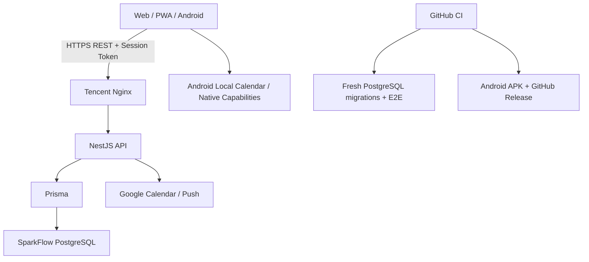
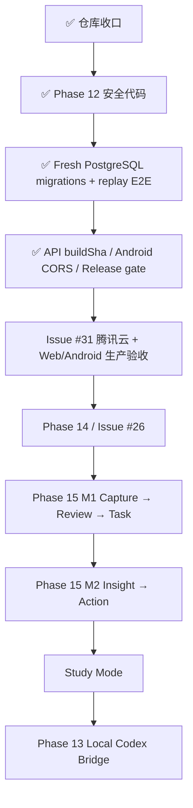

# SparkFlow — 项目开发蓝图

> **角色**：记录当前架构、产品主线、阶段状态、关键风险和长期方向。  
> **近期执行顺序**：以 [`docs/plans/NEXT.md`](docs/plans/NEXT.md) 为唯一事实源。  
> **最后更新**：2026-09-18  
> **代码同步基线**：`master@8e7e0700`

---

## 一、产品定位

SparkFlow 是一个面向个人学习、工作与日常安排的智能效率系统。目标不是分别做“任务 App”“日历 App”或“笔记 App”，而是把 **记录、计划、排程、专注、复盘与学习** 串在同一条可追溯工作流中。

当前核心效率链路：

```text
今天 → 待办 / 课程 / 日历 → 时间轴 → AI / Scheduler 安排 → 专注 → 完成
```

Phase 15 继续补齐：

```text
记录 → 回顾 → 洞察 → 行动 → Planner / Timeline / Focus
```

Study Mode 作为建立在现有能力之上的学习工作区：

```text
Folder → Today → Focus → Review → Schedule
```

三条链路共享 Task、Course、Calendar、Planner、Focus 等现有事实源，不建立互相隔离的第二套业务系统。

---

## 二、当前有效架构决策

| # | 决策 | 当前方案 | 原因 |
|---|---|---|---|
| 1 | 生产数据与认证 | 腾讯云独立 PostgreSQL + SparkFlow API 自建密码/Session 认证 | 与 DeepTutor 数据库隔离，服务端统一控制身份和数据归属 |
| 2 | 业务链路 | Web/PWA/APK → NestJS REST → Prisma → PostgreSQL | 避免多事实源和客户端直接写数据库 |
| 3 | Web 部署 | Vercel 主项目 `sparkflow031` / `fish-life.cc.cd` | 静态前端与后端基础设施分离 |
| 4 | API 部署 | 腾讯云 Docker + Nginx / `api.fish-life.cc.cd` | API 与数据库自主可控 |
| 5 | API 版本追溯 | Docker `BUILD_SHA` + `/api/health.buildSha` | 生产验收必须能确认实际运行 commit，不能只看 health 200 |
| 6 | 客户端 | React + TypeScript + Vite；Capacitor 构建 Android | Web、PWA、Android 复用核心界面与逻辑 |
| 7 | Android API/CORS | 生产 API 固定由 `.env.production` 驱动；API 显式允许受控 Capacitor Origin | 避免 Web 可用而 APK 被 CORS/配置分叉阻断 |
| 8 | 日程事实源 | Task 与 CalendarEvent 投影为统一 `ScheduleItem` | Today、Timeline、Planner 使用同一显示与冲突口径 |
| 9 | AI 排程 | LLM 负责语言→意图；确定性 Scheduler 决定具体时间 | 保证锁定、冲突、截止时间和撤销可复现 |
| 10 | AI 行动原则 | Preview → Confirm/Apply → Undo | AI 不直接替用户执行不可逆修改 |
| 11 | 课程导入 | 客户端获取/解析/预览；服务端负责授权、幂等、重复/冲突、事务和结果查询 | 避免重复、半写入和跨用户数据问题 |
| 12 | 数据库发布门禁 | CI 在 fresh PostgreSQL 16 上运行全量 migration + targeted real-DB E2E | 验证历史 migration 对独立 PostgreSQL 的真实可落地性 |
| 13 | Android 发布 | 构建前后校验 production API；APK/Artifact/Release 绑定 commit SHA | 每个真机包都能追溯来源与 API 目标 |
| 14 | 记录事实源 | Phase 15 统一到服务端 `Inspiration` | 逐步淘汰前端旧 `Spark` 作为主事实源 |
| 15 | Study Mode | 复用 Course / Task / Calendar / Planner / Focus | 学习场景是工作区，不是第二套效率系统 |
| 16 | Local Codex Bridge | 独立本机 loopback Gateway，native Codex 为唯一执行事实源 | 不进入云端生产控制链，不建立第二套 runtime/transcript |

---

## 三、已被替代的历史方案

| 历史方案 | 当前状态 | 替代方案 |
|---|---|---|
| CURRENT_CONTEXT.md、ContextBridge、`@start/@duration` | ❌ 已取消 | 纯 REST + 服务端事实源 |
| API Key / localStorage 账户 / Supabase Auth | ❌ 已替代 | 自建密码 + `AuthSession` |
| Supabase PostgreSQL 作为生产主库 | ❌ 已替代 | 腾讯云独立 PostgreSQL |
| Render 生产 API | ❌ 已替代 | 腾讯云 Docker + Nginx |
| 前端 Sparks 作为记录主事实源 | ⚠️ 逐步退出 | Phase 15 `Inspiration` |
| PR #14 旧 Timeline V2 分支 | ❌ 已关闭，不再直接合并 | Issue #26 从最新 master 重做 M3 余项 |
| PR #23 Study Mode 早期提案 | ❌ 已关闭 | PR #25 / `docs/study-mode/` |
| Android 仅靠临时 Actions artifact | ❌ 已替代 | commit-stamped APK + GitHub prerelease |

历史审计与旧方案保留在 `docs/archive/` 与冻结 Phase 文档中。

---

## 四、当前系统架构



### 数据与身份边界

1. 服务端 Session 是身份事实源。
2. 客户端传入的 `userId` 不得作为授权依据。
3. Task、CalendarEvent、Course、Semester、PomodoroSession、SchedulePlan、CourseImportBatch 等业务实体按当前登录用户隔离。
4. 数据库 migration 必须 additive、可验证、可备份。
5. CI 中的 fresh PostgreSQL 成功证明“代码/迁移可落地”，不等于腾讯云生产 migration 已执行。
6. `/api/health` 200 只说明进程可用；生产版本验收还必须比对 `buildSha`。
7. Android 与 Web 必须使用同一生产 API 契约，不允许长期分叉配置。
8. Android API CORS 只允许显式 Web Origin 与受控 Capacitor Origin，不使用 wildcard。

---

## 五、当前主要产品模块

### Today

- 聚合课程、任务、日历和日程。
- 作为“今天怎么过”的主入口。
- 后续承载 Phase 15 Review 与 Study Mode 聚合入口。

### Task / Todos

- 创建、编辑、完成、删除。
- 优先级、截止时间、预计时长、项目/分区、提醒、重复、子任务。
- 列表、四象限、甘特图等组织方式。
- PR #24 已合并：课程任务统一进入共享 Task Store，并保留 `courseId`、标签、状态和删除能力。

### Timeline / Calendar

- Task 与 CalendarEvent 统一投影。
- 当前 master 保留既有 `CalendarView` 与 Gantt 能力。
- 旧 PR #14 不直接合并；剩余 M3 要求由 Issue #26 从最新 master 重做。

### Planner / AI 安排

- Preview → Apply → Undo 已具备基础实现。
- 确定性 Scheduler 为唯一时间决策层。
- 下一阶段补充自然语言意图和“帮我顺延”。
- `SchedulePlan` migration 已进入代码/CI；生产库仍需 Issue #31 核验。

### Focus

- 任务进入专注流程。
- Pomodoro / Focus 记录持久化。
- 连接安排与完成。

### Course / Import

课程导入当前主链路：

```text
SchoolImport / JSON
  ↓
本地结构化作息与 ScheduleBackup
  ↓
V2 requestId envelope
  ↓
服务端 Preview
  ├─ stable fingerprint
  ├─ duplicate detection
  └─ time conflict detection
  ↓
Serializable Transaction
  ↓
CourseImportBatch + Course + CalendarEvent
  ↓
异常时按 requestId 查询 / 成功结果 replay
```

已验证层级：

- **代码/单元层**：PR #28 覆盖处理中不可重放、并发竞争恢复、事务错误传播、用户范围查询隔离。
- **数据库 migration 层**：PR #29 在全新 PostgreSQL 16 上成功应用完整 migration chain。
- **真实 Prisma/PostgreSQL I/O 层**：PR #30 完成首次导入 + 相同 requestId replay，最终仅一份 batch / course / course event。
- **部署可观测层**：PR #32 建立 `BUILD_SHA` / health buildSha 追溯。
- **Android 登录代码侧**：PR #33 增加 `https://localhost` / `capacitor://localhost` CORS 支持。
- **Android 发布层**：PR #34 校验 production API，并发布 commit-stamped APK 到 GitHub Releases。

**当前缺口已经严格收缩为生产证据**：腾讯云 migration / buildSha、真实 Web 学校导入、Android 真机登录/导入和 Planner 真账号闭环。统一由 Issue #31 承接。

### Android / Release

当前 Android 发布链：

```text
master push
  ↓
Web tests
  ↓
验证 .env.production API
  ↓
Vite build
  ↓
验证 production API 已嵌入 dist
  ↓
Capacitor sync + Gradle
  ↓
APK commit-stamp + SHA-256
  ↓
Actions artifact + GitHub prerelease
```

首个通过该门禁的 Release：

```text
tag: android-8e7e0700f894
asset: sparkflow-8e7e0700f894-debug.apk
source: master@8e7e0700f894e254af509314f83ea7cd8359482c
```

### Record / Inspiration（Phase 15）

```text
Capture → Review → Insight → Action
```

M1：统一 Inspiration、随手记、Reflection、回顾、转 Task。  
M2：Theme / Evolution / Action Insight，并保持来源可解释。

### Study Mode

已完成方案和设计资产整理，尚未进入运行时代码。

阶段顺序：M1 Study Home / StudyFolder → M2 Review → M3 Habit / Plan → M4 Template / Export。

---

## 六、Phase 状态

| Phase | 状态 | 当前说明 |
|---|---|---|
| Phase 1–8 | ✅ 历史完成 | PWA、REST、课程基础、Google Calendar、Capacitor 等；旧 md/Render/Supabase 描述已被替代 |
| Phase 09 | ⚠️ 冻结重估 | 多项能力已被后续实现覆盖 |
| Phase 10 | ⚠️ 冻结重估 | md 方案取消；认证已完成；灵感转任务由 Phase 15 接管 |
| Phase 11 | ✅ 归档 | 早期账户/Onboarding 历史方案 |
| Phase 12 | 🚧 当前 P0：生产验收 | 安全代码、migration CI、真实 PG replay、部署追溯、Android CORS/Release 门禁已具备；Issue #31 承接生产与真机证据 |
| Phase 13 | ⬜ P2 | Local Codex Bridge，等待用户主链路稳定 |
| Phase 14 | 🚧 收口中 | Today/Planner/Focus/四象限/甘特已有实现；Issue #26 承接 M3 Timeline 余项，另有自然语言排程、顺延、Receipt、深色、Settings、Widget |
| Phase 15 | ⬜ 方案完成 | M1 Capture → Review → Task；M2 Insight → Action |
| Study Mode | ⬜ M0 完成 | 提案、路线图和九张设计参考已合入；运行时代码未实施 |

---

## 七、仓库与近期里程碑

- ✅ PR #23 已关闭，由 #25 / Study Mode 正式方案替代。
- ✅ PR #24 `fad1a619`：Course linked tasks。
- ✅ PR #14 已关闭，Issue #26 承接 Timeline M3 余项。
- ✅ PR #28 `a1fe22c6`：Phase 12 safety tests。
- ✅ PR #29 `526b234e`：fresh PostgreSQL migration CI。
- ✅ PR #30 `2ffbf448`：真实 PostgreSQL import replay E2E。
- ✅ PR #32 `5158bad1`：API deployment build SHA observability。
- ✅ PR #33 `38f6cdbc`：Capacitor CORS。
- ✅ PR #34 `8e7e0700`：Android production API gate + commit-stamped GitHub Release。
- 🚧 Issue #31：当前 Phase 12 生产验收主线。
- ⏭ Issue #26：Issue #31 稳定后进入 Phase 14 Timeline 收口。

---

## 八、当前 P0/P1 风险

| 优先级 | 风险 | 已有防线 | 关闭条件 |
|---|---|---|---|
| P0 | 腾讯云运行版本 / migration 未证实 | `BUILD_SHA` + health buildSha；Docker 启动先 migrate deploy；fresh PG CI | 生产三方 SHA 对账 + `prisma migrate status` + schema 核验 |
| P0 | Web 真实学校导入未闭环 | V2 preview/import/replay + real PG E2E | 真实学校获取→预览→导入→同 requestId replay 通过 |
| P0 | Android 之前存在 Web 正常/App 登录失败 | Capacitor CORS 已修；API/Bundle 地址 CI gate；Release 可追溯 | 最新 Release 真机登录、Session 和导入通过 |
| P0 | Planner 生产 schema/闭环未证实 | SchedulePlan migration 在 fresh PG CI 成功 | 真账号 Preview → Apply → Undo |
| P1 | 更复杂真实 DB 异常场景覆盖不足 | mock 并发/rollback + real replay E2E | real PG 并发、rollback、断连恢复、跨用户隔离 E2E |
| P1 | Vercel 状态噪声 / build-rate-limit | 实际项目列表仅剩 `sparkflow031`；GitHub CI 独立 | 残留 status context 与 Hobby 额度影响不再干扰发布判断 |
| P1 | Issue #26 Timeline M3 未重做 | 当前主线仍保留 Gantt | 最新 master 上通过多来源、移动端、DST/边界验收 |

---

## 九、近期执行路线



### 当前批次：Issue #31

1. 腾讯云部署最新 master，使用 `BUILD_SHA` 构建镜像。
2. 对账 Git HEAD / container BUILD_SHA / `/api/health.buildSha`。
3. 核验生产 `SchedulePlan` 与 course-import migration。
4. Web 真账号完成真实教务导入与 replay。
5. Android 安装最新 Release，复测登录、Session、SchoolImport/文件路径与 replay。
6. Planner Preview → Apply → Undo。
7. 全部通过后，Phase 12 从“生产验收”转为完成/维护，主线进入 Phase 14。

---

## 十、发布与开发门禁

1. 从最新 master 创建短期分支，不长期堆叠大型 PR。
2. Web/API build 与 tests 必须通过。
3. 数据库相关变更必须同时通过 fresh PostgreSQL `migrate deploy/status` 和对应 real-DB E2E。
4. migration 必须 additive、可备份、可验证。
5. API 自托管生产镜像必须带 `BUILD_SHA`，且部署后与 health 回显一致。
6. Preview / CI / health 200 均不等于生产业务验收完成。
7. Android 构建必须校验 production API、输出 commit-stamped APK 和 SHA-256，并保留 GitHub Release。
8. Android 功能相关改动必须有真机登录、网络、safe-area、软键盘和核心导航回归。
9. 数据修改型 AI 必须 Preview/Confirm，并尽量支持 Undo。
10. 开放 PR 落后 master 时先做能力对账，不因旧 CI 通过就直接合并。
11. 文档只写已证实事实；“代码存在”“CI 成功”“生产可用”使用不同状态口径。
12. 每次合并、生产迁移、真实设备验收后同步 `NEXT.md`、相关 Phase、`INDEX.md` 与本蓝图。

---

## 十一、文档事实源

- **近期执行顺序**：[`docs/plans/NEXT.md`](docs/plans/NEXT.md)
- **方案索引**：[`docs/plans/INDEX.md`](docs/plans/INDEX.md)
- **Phase 12**：`docs/plans/phase12-course-import-experience.md`
- **Phase 12 生产验收**：GitHub Issue #31
- **Phase 14**：`docs/plans/phase14-rhythm-experience.md` + Issue #26
- **Phase 15**：`docs/plans/phase15-capture-review-insight-action.md`
- **Study Mode**：`docs/study-mode/README.md` + `docs/study-mode/roadmap.md`
- **自托管部署**：`docs/DEPLOY.md`
- **历史方案**：`docs/archive/`

发生冲突时，优先级为：

```text
当前代码 / 生产事实
  > NEXT.md
  > PROJECT_BLUEPRINT.md
  > INDEX.md
  > Phase 方案
  > 历史/归档文档
```
