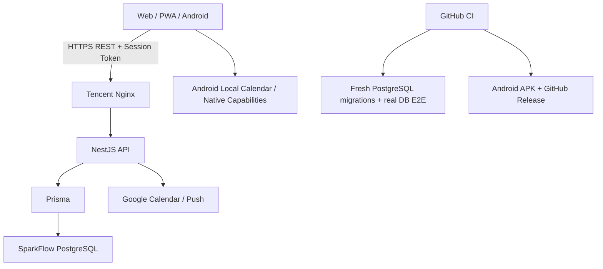
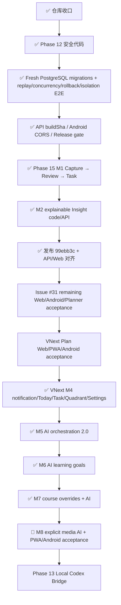

# SparkFlow — 项目开发蓝图

> **角色**：记录当前架构、产品主线、阶段状态、关键风险和长期方向。  
> **近期执行顺序**：以 [`docs/plans/NEXT.md`](docs/plans/NEXT.md) 为唯一事实源。  
> **最后更新**：2026-09-20
> **代码同步基线**：`master@dc90a61e`

---

## 一、产品定位

SparkFlow 是一个面向个人学习、工作与日常安排的智能效率系统。目标不是分别做“任务 App”“日历 App”或“笔记 App”，而是把 **记录、计划、排程、专注、复盘与学习** 串在同一条可追溯工作流中。

当前核心效率链路：

```text
今天 → 待办 / 课程 / 日历 → 时间轴 → AI / Scheduler 安排 → 专注 → 完成
```

Phase 15 继续补齐：

```text
记录 → 回顾 → 洞察 → 行动 → Planner / Timeline / Focus
```

学习工作区已升级为独立 AI 学习目标链路：

```text
学习目标 → AI 访谈 / Research → 阶段 / 里程碑 → 共享 Task → Schedule / Focus → 执行反馈 → 增量调整
```

这些链路继续共享 Task、Course、Calendar、Planner、Focus 等现有事实源；Study 不再把 Course 当作组成部分，也不建立第二套 Task/Calendar。

---

## 二、当前有效架构决策

| # | 决策 | 当前方案 | 原因 |
|---|---|---|---|
| 1 | 生产数据与认证 | 腾讯云独立 PostgreSQL + SparkFlow API 自建密码/Session 认证 | 与 DeepTutor 数据库隔离，服务端统一控制身份和数据归属 |
| 2 | 业务链路 | Web/PWA/APK → NestJS REST → Prisma → PostgreSQL | 避免多事实源和客户端直接写数据库 |
| 3 | Web 部署 | Vercel 主项目 `sparkflow031` / `fish-life.cc.cd`；Git 自动 deployments 关闭，CI 后显式发布 Production | 避免 Hobby 每日 deployment 配额被短分支小 commit 耗尽，同时保持静态前端与后端基础设施分离 |
| 4 | API 部署 | 腾讯云 Docker + Nginx / `api.fish-life.cc.cd` | API 与数据库自主可控 |
| 5 | API 版本追溯 | Docker `BUILD_SHA` + `/api/health.buildSha` | 生产验收必须能确认实际运行 commit，不能只看 health 200 |
| 6 | 客户端 | React + TypeScript + Vite；Capacitor 构建 Android | Web、PWA、Android 复用核心界面与逻辑 |
| 7 | Android API/CORS | 生产 API 固定由 `.env.production` 驱动；API 显式允许受控 Capacitor Origin | 避免 Web 可用而 APK 被 CORS/配置分叉阻断 |
| 8 | 日程事实源 | Task 与 CalendarEvent 投影为统一 `ScheduleItem` | Today、Timeline、Planner 使用同一显示与冲突口径 |
| 9 | AI 排程 | LLM 负责语言→意图；确定性 Scheduler 决定具体时间 | 保证锁定、冲突、截止时间和撤销可复现 |
| 10 | AI 行动原则 | Preview → Confirm/Apply → Undo | AI 不直接替用户执行不可逆修改 |
| 11 | 课程导入 | 客户端获取/解析/预览；服务端负责授权、幂等、重复/冲突、事务和结果查询 | 避免重复、半写入和跨用户数据问题 |
| 12 | 数据库发布门禁 | CI 在 fresh PostgreSQL 16 上运行全量 migration + 真实数据库 targeted E2E | 验证历史 migration、幂等、并发、rollback 和用户隔离 |
| 13 | Android 发布 | 构建前后校验 production API；APK/Artifact/Release 绑定 commit SHA | 每个真机包都能追溯来源与 API 目标 |
| 14 | 记录事实源 | Phase 15 统一到服务端 `Inspiration`，Reflection 独立历史，Insight 使用 N:N 来源关系 | 记录、回顾、洞察都可追溯，不把 AI 输出当原始事实 |
| 15 | AI 洞察与行动 | OpenAI-compatible Provider；Insight 只产生候选，Action 经用户确认后写入共享 Task，并保留 `insightId` 回链 | 保留用户控制权，可回答“为什么做这个任务” |
| 16 | Study / 学习工作区 | 与 Course 产品逻辑解耦；以 StudyFolder 作为学习目标容器，AI 通过目标访谈生成共享 Task / Calendar 安排 | 课程是学校课程事实，学习是目标规划场景；两者不应互相绑死，同时仍不建立第二套 Task/Calendar |
| 17 | Local Codex Bridge | 独立本机 loopback Gateway，native Codex 为唯一执行事实源 | 不进入云端生产控制链，不建立第二套 runtime/transcript |
| 18 | VNext 信息架构 / Plan | 一级导航固定为今天/计划/记录/学习/我的；Plan 通过前端 PlanItem 统一投影 Task/Course/CalendarEvent，Planner Preview 仅为临时视图态 | 降低入口膨胀与重复课表/日历风险，同时保持现有事实源和 Preview→Apply→Undo 用户控制 |
| 19 | AI 调度中枢 | “AI 帮我安排”升级为支持文字 + 语音的对话式 AI 规划与调整；AI 自适应访谈并维护持续 Planning Context（confirmed/inferred/assumed、约束、偏好、strategy、revision），当规划依赖当前外部事实时通过独立 WebResearchService/SearchProvider 主动检索并记录证据；LLM 负责澄清/意图/解释，确定性 Scheduler 与现有 Task/Course/Calendar 负责事实写入 | 后续临时冲突、时间变化、外部事实变化与目标变化默认做增量重规划，不从零猜历史；同时保持 Preview→Apply→Undo 与可复现约束，语音和联网研究都不能绕过确认 |
| 20 | 课程单次变动 | Course 继续是周期模板；调课/换课/停课/补课通过 CalendarEvent override 表达，不静默改动未来周期 | 区分“这一次变动”和“以后都这样”，避免一次调课污染整学期 |
| 21 | 多模态记录 | Inspiration 为记录主事实，图片/音频/视频使用从属 Attachment 元数据 + 文件存储 | 保持记录可追溯，不把大文件直接塞入数据库，也不在上传时默认消耗 AI 额度 |
| 22 | 持续规划上下文 | 原始对话保留在 AIConversation；新增最小 PlanningThread/Planning Context 保存用户已确认需求、约束、偏好、strategy、assumptions 与 revision；SchedulePlan 可回链上下文版本 | 避免每次重规划从长聊天重新推断，降低遗漏已确认约束、token 成本与不一致；Planning Context 不是第二套聊天记录 |
| 23 | 规划可靠性 / Web Research | AI Provider 与 Search Provider 分离；新增 WebResearchService，首批 SearchProvider 可接自托管 SearXNG；高影响事实优先官方/第一方来源并保留 claim/url/sourceType/fetchedAt/expiresAt/confidence | 让计划使用当前可核实事实，同时避免把搜索结果直接当真；Research 结果进入 Planning Context evidence，过期/冲突时重新核验并向用户说明 |
| 24 | 课程周期与单次变动 | 单次调课/换课/停课/补课使用 CalendarEvent occurrence override；“以后都改”使用 Course template Preview/Apply/Undo | 保留历史课次与单次例外，避免一次调整污染整学期模板 |
| 25 | 通知偏好 | 任务/课程提醒、默认提前量、安静时段、时区保存在既有 `User.settings.notification`；NotificationDelivery 继续去重 | PWA/Android 共用账户偏好，同时避免再建第二套通知设置表 |
| 26 | 外观 | “跟随系统 / 浅色 / 深色”使用现有前端 UserPreferences + CSS Token / `data-sf-theme` | 外观是设备 UI 偏好，不修改业务事实，也不引入无后端能力的假 AI 设置 |

---

## 三、已被替代的历史方案

| 历史方案 | 当前状态 | 替代方案 |
|---|---|---|
| CURRENT_CONTEXT.md、ContextBridge、`@start/@duration` | ❌ 已取消 | 纯 REST + 服务端事实源 |
| API Key / localStorage 账户 / Supabase Auth | ❌ 已替代 | 自建密码 + `AuthSession` |
| Supabase PostgreSQL 作为生产主库 | ❌ 已替代 | 腾讯云独立 PostgreSQL |
| Render 生产 API | ❌ 已替代 | 腾讯云 Docker + Nginx |
| 前端 Sparks 作为记录主事实源 | ⚠️ 逐步退出 | Phase 15 `Inspiration` |
| PR #14 旧 Timeline V2 分支 | ❌ 已关闭，不再直接合并 | Issue #26 从最新 master 重做 M3 余项 |
| PR #23 Study Mode 早期提案 | ❌ 已关闭 | PR #25 / `docs/study-mode/` |
| Android 仅靠临时 Actions artifact | ❌ 已替代 | commit-stamped APK + GitHub prerelease |

历史审计与旧方案保留在 `docs/archive/` 与冻结 Phase 文档中。

---

## 四、当前系统架构



### 数据与身份边界

1. 服务端 Session 是身份事实源。
2. 客户端传入的 `userId` 不得作为授权依据。
3. Task、CalendarEvent、Course、Semester、PomodoroSession、SchedulePlan、CourseImportBatch 等业务实体按当前登录用户隔离。
4. 数据库 migration 必须 additive、可验证、可备份。
5. CI 中的 fresh PostgreSQL 成功证明“代码/迁移/关键事务行为可落地”，不等于腾讯云生产 migration 已执行。
6. `/api/health` 200 只说明进程可用；生产版本验收还必须比对 `buildSha`。
7. Android 与 Web 必须使用同一生产 API 契约，不允许长期分叉配置。
8. Android API CORS 只允许显式 Web Origin 与受控 Capacitor Origin，不使用 wildcard。

---

## 五、当前主要产品模块

### Today

- 聚合课程、任务、日历和日程。
- 作为“今天怎么过”的主入口。
- 后续承载 Phase 15 Review 与 Study Mode 聚合入口。

### Task / Todos

- 创建、编辑、完成、删除。
- 优先级、截止时间、预计时长、项目/分区、提醒、重复、子任务。
- 列表、四象限、甘特图等组织方式。
- PR #24 已合并：课程任务统一进入共享 Task Store，并保留 `courseId`、标签、状态和删除能力。

### Timeline / Calendar

- Task 与 CalendarEvent 统一投影。
- 当前 master 保留既有 `CalendarView` 与 Gantt 能力。
- 旧 PR #14 不直接合并；剩余 M3 要求由 Issue #26 从最新 master 重做。

### VNext Plan Workspace

PR #48/#49/#50 已完成 M1–M3 代码与 CI：

- 固定五工作空间：今天 / 计划 / 记录 / 学习 / 我的。
- Plan 内提供 Month / Week / Agenda / Timetable；Course、CalendarEvent、scheduled Task、Study Task 共用前端投影。
- task-backed CalendarEvent 与 Course fallback 在投影层去重，不新增数据库事实源。
- 学期起止日期与 Course.weeks 用于周次/“非本周”判断；缺少可靠学期上下文时不强行隐藏课程。
- Planner Preview 可作为虚线临时时间块显示在 Week / Agenda；Apply 后由真实 Task 排程替代，Undo 后恢复。
- Web Production 已从 `master@e883b9a3` 源码显式发布到 READY 部署 `dpl_BSM7vB7tF2V43sfDLw8cNPH2Pf6e`，`fish-life.cc.cd` HTTP 200；生产 bundle 已静态核到五项导航与 M3 Preview 文案。
- Android VNext M3 Release `android-7145ba0ea3d2` 已生成；Web 真账号/PWA 与 Android 真机交互仍未验收，完成前不进入 M4 拖拽/过滤增强。

### Planner / AI 规划与调整

- 对话式 AI PlanningThread / Planning Context、语音输入、SearXNG Web Research 已进入主线。
- create/update Task、临时冲突增量重排、学习目标变化、课程单次/周期变更都先形成可审阅草案。
- 确定性 Scheduler / CourseService 仍是具体时间与课程写入的唯一决策边界；AI 不直接改真实日程。
- Task / Course 变更继续使用 Preview → Apply → Undo，并通过 SchedulePlan 保存可恢复快照。
- 上述为仓库代码事实；最新 VNext migrations 尚需随最新 master 完成腾讯云生产部署/验收。

### Focus

- 任务进入专注流程。
- Pomodoro / Focus 记录持久化。
- 连接安排与完成。

### Course / Import

课程导入当前主链路：

```text
SchoolImport / JSON
  ↓
本地结构化作息与 ScheduleBackup
  ↓
V2 requestId envelope
  ↓
服务端 Preview
  ├─ stable fingerprint
  ├─ duplicate detection
  └─ time conflict detection
  ↓
Serializable Transaction
  ↓
CourseImportBatch + Course + CalendarEvent
  ↓
异常时按 requestId 查询 / 成功结果 replay
```

已验证层级：

- **代码/单元层**：PR #28 覆盖处理中不可重放、并发竞争恢复、事务错误传播、用户范围查询隔离。
- **数据库 migration 层**：PR #29 在全新 PostgreSQL 16 上成功应用完整 migration chain。
- **真实 Prisma/PostgreSQL replay 层**：PR #30 完成首次导入 + 相同 requestId 顺序 replay，最终仅一份 batch / course / course event。
- **真实 Prisma/PostgreSQL 高风险层**：PR #36 完成同 requestId 并发竞争、batch 创建后事务失败 rollback、同 requestId 跨用户隔离验证。
- **部署可观测层**：PR #32 建立 `BUILD_SHA` / health buildSha 追溯。
- **Android 登录代码侧**：PR #33 增加 `https://localhost` / `capacitor://localhost` CORS 支持。
- **Android 发布层**：PR #34 校验 production API，并发布 commit-stamped APK 到 GitHub Releases。

**当前缺口已经严格收缩为生产/HTTP 证据**：腾讯云 migration / buildSha、真实 Web 学校导入、Android 真机登录/导入、Planner 真账号闭环，以及客户端未知网络结果的端到端恢复。统一由 Issue #31 承接。

### Android / Release

当前 Android 发布链：

```text
master push
  ↓
Web tests
  ↓
验证 .env.production API
  ↓
Vite build
  ↓
验证 production API 已嵌入 dist
  ↓
Capacitor sync + Gradle
  ↓
APK commit-stamp + SHA-256
  ↓
Actions artifact + GitHub prerelease
```

当前最新通过该门禁的 Release：

```text
tag: android-5835e3223748
asset: sparkflow-5835e3223748-debug.apk
source: master@5835e322374862e691bef6b48d4bc6feac7a4a58
```

后续仅修改 API/tests/docs 时不会触发新的 Android Release；涉及 `web/**` 或 Android workflow 的 master 变更才会生成新包。

### Record / Inspiration（Phase 15）

```text
Capture → Review → Insight → Action
```

M1：✅ Inspiration、随手记、Reflection、回顾、记录 → Task 已实现并完成生产核心链路。  
M2：🚧 Theme / Evolution / Action Insight 与来源解释已实现；真实 Qwen Provider 已有生产调用证据；PR #43 已完成 thinking/JSON mode/重试/超时稳定性修复，待最新 master 生产复验。  
M3：🚧 Insight → 用户确认 Task 与双向回链已实现；腾讯云 API 与 Vercel Production 已对齐 `99ebb3c`，仍待真实账户完成完整链路验收。

### Study / 学习工作区

VNext M6 已进入主线：

- Study 新 UI 不再聚合/关联 Course；旧 StudyFolderCourse 仅保留兼容。
- StudyFolder 作为“学习目标容器”，每个进行中目标可复用独立 PlanningThread。
- AI 围绕成功标准、当前水平、资源、时间预算与取舍进行自适应访谈，并可复用 Web Research。
- 阶段/里程碑由目标关联共享 Task 的 `project` 投影，不增加第二套 roadmap/task 表。
- AI 创建的执行项仍是共享 Task；真实完成/逾期/Pomodoro 数据派生为下一轮重规划反馈。
- 用户明确改变目标时先生成 `update_goal` 草案，确认后才更新目标。

---

## 六、Phase 状态

| Phase | 状态 | 当前说明 |
|---|---|---|
| Phase 1–8 | ✅ 历史完成 | PWA、REST、课程基础、Google Calendar、Capacitor 等；旧 md/Render/Supabase 描述已被替代 |
| Phase 09 | ⚠️ 冻结重估 | 多项能力已被后续实现覆盖 |
| Phase 10 | ⚠️ 冻结重估 | md 方案取消；认证已完成；灵感转任务由 Phase 15 接管 |
| Phase 11 | ✅ 归档 | 早期账户/Onboarding 历史方案 |
| Phase 12 | 🚧 当前 P0：真实链路验收 | 安全代码、migration CI、真实 PG 顺序/并发 replay、rollback、用户隔离、部署追溯、Android CORS/Release 门禁已具备；Issue #31 承接生产和真机证据 |
| Phase 13 | ⬜ P2 | Local Codex Bridge，等待用户主链路稳定 |
| Phase 14 | 🚧 收口中 | Today/Planner/Focus/四象限/甘特已有实现；Issue #26 承接 M3 Timeline 余项，另有自然语言排程、顺延、Receipt、深色、Settings、Widget |
| Phase 15 | 🚧 M1–M3 已实现，真实链路收尾 | M1–M3 Web/API 已对齐 `99ebb3c`；真实 Qwen 与 Android/Planner 链路仍需验收 |
| Study Mode | 🚧 M1 已部署 | PR #45 已合入；StudyFolder migration、API 与 Web Production 已上线，待真实账户验收 |
| VNext Plan | 🚧 M1–M3 已发布，待真账号/真机 | PR #48/#49/#50 已合入；Web Production 已发布并静态冒烟，Android M3 APK `android-7145ba0ea3d2` 已生成；真实账号与真机验收前 M4 暂不启动 |
| VNext AI Orchestration | ✅ M4–M7；🚧 M8 最后收口 | PR #59–#63 完成 AI Planning；#66/#68/#69 完成学习目标；#70–#73 完成课程变动；#74/#77/#78 完成多模态 Capture、通知偏好和 Settings/外观。剩余显式附件 AI 转录/摘要与 PWA/Android 真机验收 |

---

## 七、仓库与近期里程碑

- ✅ PR #23 已关闭，由 #25 / Study Mode 正式方案替代。
- ✅ PR #24 `fad1a619`：Course linked tasks。
- ✅ PR #14 已关闭，Issue #26 承接 Timeline M3 余项。
- ✅ PR #28 `a1fe22c6`：Phase 12 safety tests。
- ✅ PR #29 `526b234e`：fresh PostgreSQL migration CI。
- ✅ PR #30 `2ffbf448`：真实 PostgreSQL import replay E2E。
- ✅ PR #32 `5158bad1`：API deployment build SHA observability。
- ✅ PR #33 `38f6cdbc`：Capacitor CORS。
- ✅ PR #34 `8e7e0700`：Android production API gate + commit-stamped GitHub Release。
- ✅ PR #35 `7afb7bb4`：规划文档同步。
- ✅ PR #36 `4569a3a1`：真实 PostgreSQL 并发 / rollback / 用户隔离 E2E。
- ✅ PR #38：Phase 15 M1 Capture → Review → Task。
- ✅ PR #39：Phase 15 M2 explainable Insights。
- ✅ PR #40：Phase 15 M3 Insight → confirmed Task + 双向回链。
- ✅ PR #41：重复 M3 实现已关闭，未合并。
- ✅ PR #43：Qwen Insight 稳定性与 API 请求超时治理，已合并并随之后的 `master@99ebb3c` 生产版本上线。
- ✅ PR #45：Study Mode M1 workspace、StudyFolder migration/API/Web 已合并至 `master@99ebb3c` 并完成生产部署。
- ✅ PR #47：VNext 五工作空间与 Plan 重构详细方案。
- ✅ PR #48：VNext M1，固定五项导航 + Plan 四视图壳层。
- ✅ PR #49：VNext M2，真实 Task/Course/CalendarEvent/Study Task 统一投影。
- ✅ PR #50：VNext M3，Planner Preview 时间块 → Apply → Undo 视图闭环；Web/API CI 全绿。
- ✅ PR #54：AI-first VNext M4–M8 完整方案，包含自适应访谈、持续 Planning Context、语音输入与 Web Research。
- ✅ PR #55：M4.1/M4.2，按用户隔离通知、reminderAt 优先、持久化 delivery key，以及 Today 极简。
- ✅ PR #56：M4.3/M4.4，统一新建 Task Sheet，Plan 待办列表/四象限切换，手机 2×2 同屏。
- ✅ PR #58：M4.5，“我的/设置”改为分组首页 + 二级设置；真实四象限偏好、默认提醒、Push 测试、日历连接和数据/账户能力保留。
- ✅ PR #59：M5.1，PlanningThread / Context、revision 并发保护、SchedulePlan 规划版本回链。
- ✅ PR #60：M5.2，对话式 AI Planner、SearXNG ResearchProvider、证据展示与“临时安排”。
- ✅ PR #61：M5.3，Qwen ASR 语音输入与可编辑 Planning Context。
- ✅ PR #62：M5.4，对话 → 可审阅 create/update Task proposals，用户确认后才写入。
- ✅ PR #63：M5.5，临时冲突增量重排；Scheduler 计算移动 Preview，Apply/Undo 沿用现有安全边界。
- ✅ PR #66：M6.1，Study 重建为独立 AI 学习目标工作区与目标专属 PlanningThread。
- ✅ PR #68：M6.2，阶段/里程碑通过共享 Task.project 投影，不新增第二套路线事实源。
- ✅ PR #69：M6.3，执行反馈快照与显式学习目标变化。
- ✅ PR #70：M7.1，课程单次调课/换课/停课/补课 occurrence override + Preview/Apply。
- ✅ PR #71：M7.2，typed SchedulePlan 支持课程安全 Undo。
- ✅ PR #72：M7.3，AI 自然语言课程变动复用 Course Preview/Apply/Undo。
- ✅ PR #73：M7.4，周期 Course 模板变更与单次 override 严格分离并支持 Undo。
- ✅ PR #74：M8.1，Inspiration 私有图片/音频/视频附件、语音录制与媒体预览。
- ✅ PR #77：M8.2，账户级任务/课程提醒、安静时段、时区与测试通知。
- ✅ PR #78：M8.3，Settings 视觉收尾与真实跟随系统/浅色/深色外观；主线到 `master@dc90a61e`。
- ✅ VNext Web Production：部署 `dpl_BSM7vB7tF2V43sfDLw8cNPH2Pf6e` READY，aliases 包含 `fish-life.cc.cd`；首页 200，生产 bundle 核到五项导航与 M3 Preview 文案。
- ✅ Android VNext M3 构建：Release `android-7145ba0ea3d2`，asset `sparkflow-7145ba0ea3d2-debug.apk`。
- ⚠️ 本次 Vercel 由 GitHub codeload 源码手工发布，deployment `meta` 为空；尝试仅补 Git metadata 的第二次部署被 Hobby 每日 deployment 限额拒绝。功能部署已成功，本蓝图/NEXT 记录 `e883b9a3 → dpl_BSM7vB7tF2V43sfDLw8cNPH2Pf6e` 的发布映射。
- ✅ PR #27：旧 Phase 12 安全测试分支已关闭，由 #28/#29/#30/#36 覆盖。
- 🚧 Issue #31：当前 Phase 12 生产验收主线。
- ⏭ Issue #26：Issue #31 稳定后进入 Phase 14 Timeline 收口。

---

## 八、当前 P0/P1 风险

| 优先级 | 风险 | 已有防线 | 关闭条件 |
|---|---|---|---|
| ✅ | 腾讯云运行版本 / migration | `BUILD_SHA` + health buildSha；fresh PG CI；生产 `99ebb3c` 已对账 | 20 migrations 已 up to date，转为常规发布核验 |
| P0 | Web 真实学校导入未闭环 | V2 preview/import/replay + real PG 顺序/并发 E2E | 真实学校获取→预览→导入→同 requestId replay 通过 |
| P0 | Android 之前存在 Web 正常/App 登录失败 | Capacitor CORS 已修；API/Bundle 地址 CI gate；Release 可追溯 | 最新 Release 真机登录、Session 和导入通过 |
| P0 | Planner 生产 schema/闭环未证实 | SchedulePlan migration 在 fresh PG CI 成功 | 真账号 Preview → Apply → Undo |
| P1 | HTTP 未知结果恢复仍缺端到端证据 | 前端按 requestId 查询 + 服务端 replay；真实 PG 已验证最终状态 | 模拟客户端超时/断连后查询并恢复已提交结果 |
| P1 | Vercel Hobby deployment 日配额 / 本次 Git metadata 缺失 | GitHub CI 独立；Git 自动 deployments 已关闭；VNext Production 首次手工发布已成功，仓库记录 SHA→deployment 映射 | 等额度恢复后的下一次正常 Git 可追溯发布自然覆盖；不为补 metadata 重复消耗当日 deployment |
| ✅ | Push 到期提醒跨用户风险 | PR #55 已增加 user 分组、同 user subscriptions、server-only notification_deliveries 唯一 delivery key | 代码/migration/CI 已收口；生产 API 下一次部署应用 migration |
| P1 | Issue #26 Timeline M3 未重做 | 当前主线仍保留 Gantt | 最新 master 上通过多来源、移动端、DST/边界验收 |

---

## 九、近期执行路线



### 当前批次：Issue #31 真实验收 + VNext Plan M1–M3 生产/真机验收

1. ✅ 腾讯云 API 已部署 `master@99ebb3c`；Git HEAD / image / public health buildSha 已对齐。
2. ✅ 生产 PostgreSQL 20 migrations up to date，包含 M2/M3/StudyFolder。
3. ✅ VNext Web Production 已显式发布：`dpl_BSM7vB7tF2V43sfDLw8cNPH2Pf6e` READY 并绑定 `fish-life.cc.cd`；本次源码来自 GitHub `master@e883b9a3`，公网首页 200，发布后一小时 Vercel 无 runtime error。
4. 🚧 使用已接通的真实 Qwen Provider 执行多卡片 → Insight → 用户确认 Task 的成功率、延迟、来源真实性与失败恢复验收。
5. Android 安装 VNext M3 `sparkflow-7145ba0ea3d2-debug.apk`，复测登录、Session、五项底栏、四时间视图、Insight/Action、SchoolImport 和窄屏交互。
6. Web 真账号完成真实教务导入/replay，并完成 Planner Preview → Apply → Undo。
7. 验证一次客户端未知/超时结果 → requestId 查询恢复路径。
8. ✅ VNext Plan Web 已发布并完成公开静态冒烟；🚧 继续以真实账号验收五项主导航、四时间视图、课程周次、Planner Preview → Apply → Undo，并在 Android 真机复验。
9. 上述真实链路通过后，再选择 VNext M4、Phase 15 M4、Study Mode 或 Phase 14 余项作为下一产品批次。

---

## 十、发布与开发门禁

1. 从最新 master 创建短期分支，不长期堆叠大型 PR。
2. Web/API build 与 tests 必须通过。
3. 数据库相关变更必须同时通过 fresh PostgreSQL `migrate deploy/status` 和对应 real-DB E2E。
4. migration 必须 additive、可备份、可验证。
5. API 自托管生产镜像必须带 `BUILD_SHA`，且部署后与 health 回显一致。
6. Preview / CI / health 200 均不等于生产业务验收完成；Vercel Web 不再使用每 commit 自动 deployment，合并后显式发布。
7. Android 构建必须校验 production API、输出 commit-stamped APK 和 SHA-256，并保留 GitHub Release。
8. Android 功能相关改动必须有真机登录、网络、safe-area、软键盘和核心导航回归。
9. 数据修改型 AI 必须 Preview/Confirm，并尽量支持 Undo。
10. 开放 PR 落后 master 时先做能力对账，不因旧 CI 通过就直接合并。
11. 文档只写已证实事实；“代码存在”“CI 成功”“生产可用”使用不同状态口径。
12. 每次合并、生产迁移、真实设备验收后同步 `NEXT.md`、相关 Phase、`INDEX.md` 与本蓝图。

---

## 十一、文档事实源

- **近期执行顺序**：[`docs/plans/NEXT.md`](docs/plans/NEXT.md)
- **方案索引**：[`docs/plans/INDEX.md`](docs/plans/INDEX.md)
- **Phase 12**：`docs/plans/phase12-course-import-experience.md`
- **Phase 12 生产验收**：GitHub Issue #31
- **Phase 14**：`docs/plans/phase14-rhythm-experience.md` + Issue #26
- **Phase 15**：`docs/plans/phase15-capture-review-insight-action.md`
- **Study Mode**：`docs/study-mode/README.md` + `docs/study-mode/roadmap.md`
- **自托管部署**：`docs/DEPLOY.md`
- **历史方案**：`docs/archive/`

发生冲突时，优先级为：

```text
当前代码 / 生产事实
  > NEXT.md
  > PROJECT_BLUEPRINT.md
  > INDEX.md
  > Phase 方案
  > 历史/归档文档
```
