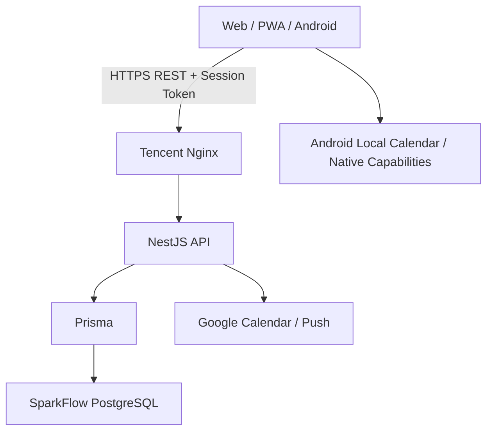
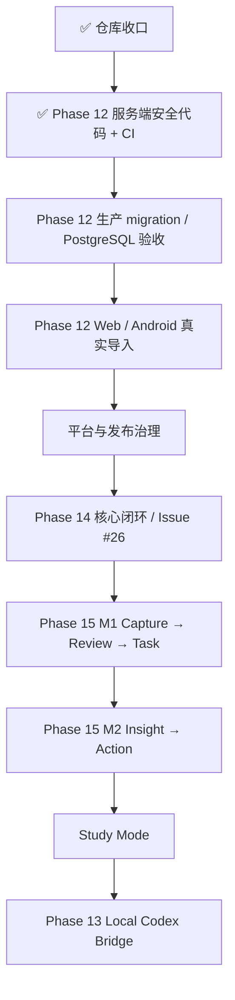

# SparkFlow — 项目开发蓝图

> **角色**：记录当前架构、产品主线、阶段状态、关键风险和长期方向。  
> **近期执行顺序**：以 [`docs/plans/NEXT.md`](docs/plans/NEXT.md) 为唯一事实源。  
> **最后更新**：2026-09-17  
> **代码同步基线**：`master@a1fe22c6`

---

## 一、产品定位

SparkFlow 是一个面向个人学习、工作与日常安排的智能效率系统。目标不是分别做“任务 App”“日历 App”或“笔记 App”，而是把 **记录、计划、排程、专注、复盘与学习** 串在同一条可追溯工作流中。

当前核心效率链路：

```text
今天 → 待办 / 课程 / 日历 → 时间轴 → AI / Scheduler 安排 → 专注 → 完成
```

Phase 15 继续补齐：

```text
记录 → 回顾 → 洞察 → 行动 → Planner / Timeline / Focus
```

Study Mode 作为建立在现有能力之上的学习工作区：

```text
Folder → Today → Focus → Review → Schedule
```

三条链路共享 Task、Course、Calendar、Planner、Focus 等现有事实源，不建立互相隔离的第二套业务系统。

---

## 二、当前有效架构决策

| # | 决策 | 当前方案 | 原因 |
|---|---|---|---|
| 1 | 生产数据与认证 | 腾讯云独立 PostgreSQL + SparkFlow API 自建密码/Session 认证 | 与 DeepTutor 数据库隔离，服务端统一控制身份和数据归属 |
| 2 | 业务链路 | Web/PWA/APK → NestJS REST → Prisma → PostgreSQL | 避免多事实源和客户端直接写数据库 |
| 3 | Web 部署 | Vercel 主项目 `sparkflow031` / `fish-life.cc.cd` | 静态前端与后端基础设施分离 |
| 4 | API 部署 | 腾讯云 Docker + Nginx / `api.fish-life.cc.cd` | API 与数据库自主可控 |
| 5 | 客户端 | React + TypeScript + Vite；Capacitor 构建 Android | Web、PWA、Android 复用核心界面与逻辑 |
| 6 | 日程事实源 | Task 与 CalendarEvent 投影为统一 `ScheduleItem` | Today、Timeline、Planner 使用同一显示与冲突口径 |
| 7 | AI 排程 | LLM 负责语言→意图；确定性 Scheduler 决定具体时间 | 保证锁定、冲突、截止时间和撤销可复现 |
| 8 | AI 行动原则 | Preview → Confirm/Apply → Undo | AI 不直接替用户执行不可逆修改 |
| 9 | 课程导入 | 客户端获取/解析/预览；服务端负责授权、幂等、重复/冲突、事务和结果查询 | 避免重复、半写入和跨用户数据问题 |
| 10 | 记录事实源 | Phase 15 统一到服务端 `Inspiration` | 逐步淘汰前端旧 `Spark` 作为主事实源 |
| 11 | Study Mode | 复用 Course / Task / Calendar / Planner / Focus | 学习场景是工作区，不是第二套效率系统 |
| 12 | Local Codex Bridge | 独立本机 loopback Gateway，native Codex 为唯一执行事实源 | 不进入云端生产控制链，不建立第二套 runtime/transcript |

---

## 三、已被替代的历史方案

| 历史方案 | 当前状态 | 替代方案 |
|---|---|---|
| CURRENT_CONTEXT.md、ContextBridge、`@start/@duration` | ❌ 已取消 | 纯 REST + 服务端事实源 |
| API Key / localStorage 账户 / Supabase Auth | ❌ 已替代 | 自建密码 + `AuthSession` |
| Supabase PostgreSQL 作为生产主库 | ❌ 已替代 | 腾讯云独立 PostgreSQL |
| Render 生产 API | ❌ 已替代 | 腾讯云 Docker + Nginx |
| 前端 Sparks 作为记录主事实源 | ⚠️ 逐步退出 | Phase 15 `Inspiration` |
| PR #14 旧 Timeline V2 分支 | ❌ 已关闭，不再直接合并 | Issue #26 从最新 master 重做 M3 余项 |
| PR #23 Study Mode 早期提案 | ❌ 已关闭 | PR #25 / `docs/study-mode/` |

历史审计与旧方案保留在 `docs/archive/` 与冻结 Phase 文档中。

---

## 四、当前系统架构



### 数据与身份边界

1. 服务端 Session 是身份事实源。
2. 客户端传入的 `userId` 不得作为授权依据。
3. Task、CalendarEvent、Course、Semester、PomodoroSession、SchedulePlan、CourseImportBatch 等业务实体按当前登录用户隔离。
4. 数据库 migration 必须 additive、可验证、可备份。
5. 健康接口 200 只表示进程可用，不能替代真实账户读写验收。
6. Android 与 Web 必须使用同一生产 API 契约，不允许出现长期分叉配置。

---

## 五、当前主要产品模块

### Today

- 聚合课程、任务、日历和日程。
- 作为“今天怎么过”的主入口。
- 后续承载 Phase 15 Review 与 Study Mode 聚合入口。

### Task / Todos

- 创建、编辑、完成、删除。
- 优先级、截止时间、预计时长、项目/分区、提醒、重复、子任务。
- 列表、四象限、甘特图等组织方式。
- PR #24 已合并：课程任务统一进入共享 Task Store，并保留 `courseId`、标签、状态和删除能力。

### Timeline / Calendar

- Task 与 CalendarEvent 统一投影。
- 当前 master 仍使用旧 `CalendarView`，并已叠加 Gantt 能力。
- 旧 PR #14 的模块化 Timeline 未进入主线，已关闭。
- 剩余 M3 要求由 Issue #26 从最新 master 重做，必须保留现有 Gantt 和后续 App/ScheduleEditor 修复。

### Planner / AI 安排

- Preview → Apply → Undo 已具备基础实现。
- 确定性 Scheduler 为唯一时间决策层。
- 下一阶段补充自然语言意图和“帮我顺延”。

### Focus

- 任务进入专注流程。
- Pomodoro / Focus 记录持久化。
- 连接安排与完成。

### Course / Import

课程导入已经不是“只有解析器”的状态。当前 V2 主链路已经具备：

```text
SchoolImport / JSON
  ↓
本地结构化作息与 ScheduleBackup
  ↓
V2 requestId envelope
  ↓
服务端 Preview
  ├─ stable fingerprint
  ├─ duplicate detection
  └─ time conflict detection
  ↓
Serializable Transaction
  ↓
CourseImportBatch + Course + CalendarEvent
  ↓
异常时按 requestId 查询 / 成功结果 replay
```

PR #28 已补齐 CI 级安全证据：处理中批次不可重放、并发竞争恢复、事务失败传播和 `(userId, requestId)` 查询隔离。

**当前缺口已从“安全代码实现”转为“生产证据”**：需要确认 migration 已在腾讯云执行，并用真实数据库、真实账号、Web/Android 做重复提交、断网/超时和回滚验收。

### Record / Inspiration（Phase 15）

```text
Capture → Review → Insight → Action
```

M1：统一 Inspiration、随手记、Reflection、回顾、转 Task。  
M2：Theme / Evolution / Action Insight，并保持来源可解释。

### Study Mode

已完成方案和设计资产整理，尚未进入运行时代码。

阶段顺序：M1 Study Home / StudyFolder → M2 Review → M3 Habit / Plan → M4 Template / Export。

---

## 六、Phase 状态

| Phase | 状态 | 当前说明 |
|---|---|---|
| Phase 1–8 | ✅ 历史完成 | PWA、REST、课程基础、Google Calendar、Capacitor 等；旧 md/Render/Supabase 描述已被替代 |
| Phase 09 | ⚠️ 冻结重估 | 多项能力已被后续实现覆盖 |
| Phase 10 | ⚠️ 冻结重估 | md 方案取消；认证已完成；灵感转任务由 Phase 15 接管 |
| Phase 11 | ✅ 归档 | 早期账户/Onboarding 历史方案 |
| Phase 12 | 🚧 当前 P0：生产验收 | V2 幂等/事务/重复冲突代码与 CI 安全测试已具备；待生产 migration、真实 PostgreSQL 与 Web/Android 验收 |
| Phase 13 | ⬜ P2 | Local Codex Bridge，等待用户主链路稳定 |
| Phase 14 | 🚧 收口中 | Today/Planner/Focus/四象限/甘特已有实现；Issue #26 承接 M3 Timeline 余项，另有自然语言排程、顺延、Receipt、深色、Settings、Widget |
| Phase 15 | ⬜ 方案完成 | M1 Capture → Review → Task；M2 Insight → Action |
| Study Mode | ⬜ M0 完成 | 提案、路线图和九张设计参考已合入；运行时代码未实施 |

---

## 七、仓库与近期里程碑

- ✅ PR #23 已关闭，由已合并的 #25 取代。
- ✅ PR #24 已 squash 合并为 `fad1a619`。
- ✅ PR #14 已关闭，Issue #26 承接 M3 Timeline V2 剩余要求。
- ✅ PR #28 已通过 Web/API CI 并 squash 合并为 `a1fe22c6`，补齐 Phase 12 服务端安全测试。
- 当前开发继续从最新 master 创建短期分支。

---

## 八、当前 P0/P1 风险

| 优先级 | 风险 | 关闭条件 |
|---|---|---|
| P0 | Course import migration 是否已在生产执行仍未证实 | 腾讯云 `_prisma_migrations` / schema 核验 `20260915120000_add_course_import_idempotency` |
| P0 | 服务端安全代码缺少真实 PostgreSQL I/O 验收 | 真实库完成重复重放、并发、超时/断连、事务回滚并确认无副本/半成品 |
| P0 | Web/Android 真实导入未完全闭环 | 两端各一条真实学校路径通过，重复提交验证幂等 |
| P0 | Android 可能出现 Web 正常但 App 登录/网络失败 | 真机验证 Session、API 地址、TLS、网络策略和错误提示 |
| P0 | Vercel 旧项目/额度状态制造误导性失败 | 区分并清理旧项目检查；解决主项目 build-rate-limit 验收问题 |
| P1 | Issue #26 Timeline M3 仍未重做 | 最新 master 上实现并通过多来源、移动端、DST/边界验收 |
| P1 | SchedulePlan 生产 migration 仍需真实核验 | 真账号跑通 Preview → Apply → Undo |
| P1 | Phase 14 未完成真实设备收口 | 核心效率链路跨 Web/PWA/Android 验收 |

---

## 九、近期执行路线



### 第一批：仓库收口 — ✅ 完成

- #23 关闭。
- #24 合并。
- #14 关闭并迁移到 Issue #26。

### 第二批 A：Phase 12 服务端安全代码 — ✅ 达到 CI 级门槛

- V2 requestId / payload hash。
- stable fingerprint / duplicate / conflict preview。
- Serializable transaction。
- CourseImportBatch 结果查询与 replay。
- PR #28 安全测试通过。

### 第二批 B：Phase 12 生产验收 — 当前主线

- 核验 course import / SchedulePlan migrations。
- 真实 PostgreSQL 并发、断网/超时、回滚验证。
- Web/Android 真实课程导入。
- Auth / courses / tasks / schedule / Planner 生产冒烟。

### 第三批：Phase 14

- Issue #26 Timeline 余项。
- 自然语言意图与顺延。
- Daily Receipt、深色、Settings。
- Android Widget 最后实施。

### 第四批：Phase 15

M1：`Quick Capture → Review → Reflection → Task`。  
M2：多记录 Insight，并坚持“AI 建议、用户确认”。

### 第五批：Study Mode

优先 Study Home + Folder + Review；模板/导出最后做。

### 第六批：Local Codex Bridge

作为独立桌面能力推进，不进入云端生产控制链。

---

## 十、发布与开发门禁

1. 从最新 master 创建短期分支。
2. 不长期堆叠大型 PR。
3. Web/API build 与 tests 必须通过。
4. migration 必须 additive、可备份、可验证。
5. Preview / CI 成功不等于生产验收完成。
6. Android 改动必须有真机登录、网络、safe-area、软键盘和核心导航回归。
7. 数据修改型 AI 必须 Preview/Confirm，并尽量支持 Undo。
8. 开放 PR 落后 master 时先做能力对账，不因旧 CI 通过就直接合并。
9. 文档只写已证实事实；“代码存在”“CI 成功”“生产可用”使用不同状态口径。
10. 每次合并、生产迁移、真实设备验收后同步 `NEXT.md`、相关 Phase、`INDEX.md` 与本蓝图。

---

## 十一、文档事实源

- **近期执行顺序**：[`docs/plans/NEXT.md`](docs/plans/NEXT.md)
- **方案索引**：[`docs/plans/INDEX.md`](docs/plans/INDEX.md)
- **Phase 12**：`docs/plans/phase12-course-import-experience.md`
- **Phase 14**：`docs/plans/phase14-rhythm-experience.md`
- **Phase 15**：`docs/plans/phase15-capture-review-insight-action.md`
- **Study Mode**：`docs/study-mode/README.md` + `docs/study-mode/roadmap.md`
- **历史方案**：`docs/archive/`

发生冲突时，优先级为：

```text
当前代码 / 生产事实
  > NEXT.md
  > PROJECT_BLUEPRINT.md
  > INDEX.md
  > Phase 方案
  > 历史/归档文档
```