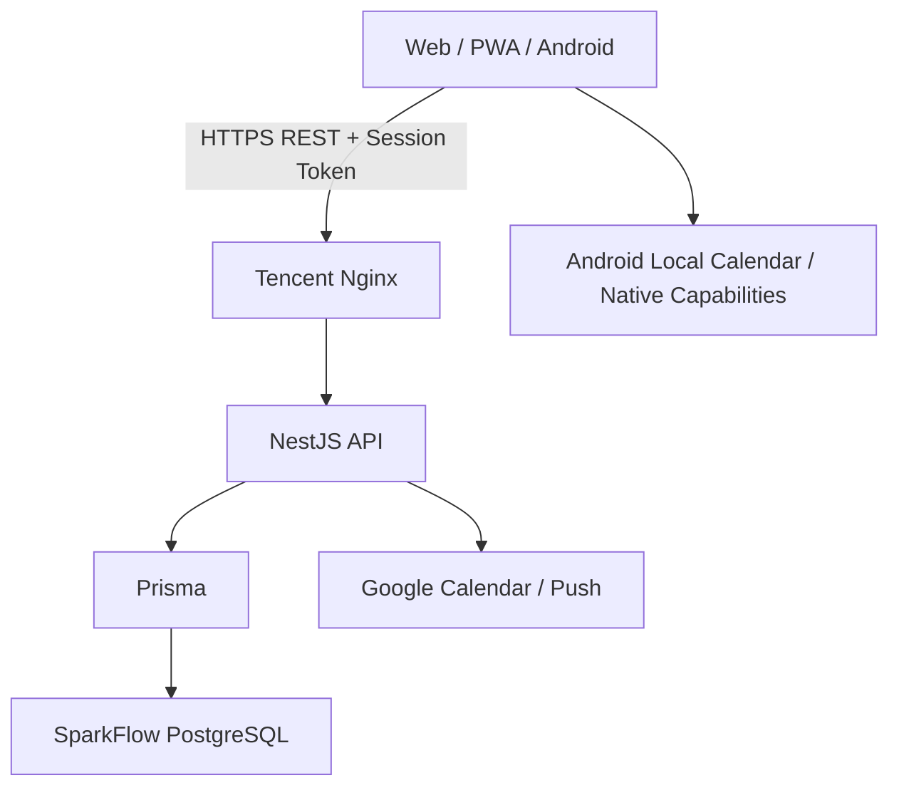
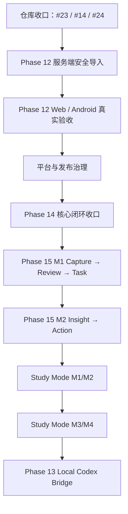

# SparkFlow — 项目开发蓝图

> **角色**：记录当前架构、产品主线、阶段状态、关键风险和长期方向。  
> **近期执行顺序**：以 [`docs/plans/NEXT.md`](docs/plans/NEXT.md) 为唯一事实源。  
> **最后更新**：2026-09-17  
> **文档同步基线**：`master@73a71c09`

---

## 一、产品定位

SparkFlow 是一个面向个人学习、工作与日常安排的智能效率系统。目标不是分别做“任务 App”“日历 App”或“笔记 App”，而是把 **记录、计划、排程、专注、复盘与学习** 串在同一条可追溯工作流中。

当前已经形成的核心效率链路：

```text
今天
  ↓
待办 / 课程 / 日历
  ↓
时间轴
  ↓
AI / Scheduler 安排
  ↓
专注
  ↓
完成
```

接下来通过 Phase 15 补齐：

```text
记录
  ↓
回顾
  ↓
洞察
  ↓
行动
  ↓
Planner / Timeline / Focus
```

Study Mode 作为建立在现有能力之上的学习工作区，后续补齐：

```text
Folder
  ↓
Today
  ↓
Focus
  ↓
Review
  ↓
Schedule
```

三条链路必须共享 Task、Course、Calendar、Planner、Focus 等既有事实源，不建立彼此隔离的第二套业务系统。

---

## 二、当前有效架构决策

| # | 决策 | 当前方案 | 原因 |
|---|---|---|---|
| 1 | 生产数据与认证 | 腾讯云独立 PostgreSQL + SparkFlow API 自建密码/Session 认证 | 与 DeepTutor 数据库隔离，服务端统一控制身份和数据归属 |
| 2 | 业务链路 | Web/PWA/APK → NestJS REST → Prisma → PostgreSQL | 避免多事实源和客户端直接写数据库 |
| 3 | Web 部署 | Vercel 主项目 `sparkflow031` / `fish-life.cc.cd` | 静态前端与后端基础设施分离 |
| 4 | API 部署 | 腾讯云 Docker + Nginx / `api.fish-life.cc.cd` | API 与数据库自主可控 |
| 5 | 客户端 | React + TypeScript + Vite；Capacitor 构建 Android | Web、PWA、Android 复用核心界面与逻辑 |
| 6 | 日程事实源 | Task 与 CalendarEvent 投影为统一 `ScheduleItem` | Today、Timeline、Planner 使用同一显示与冲突口径 |
| 7 | AI 排程 | LLM 负责语言→意图；确定性 Scheduler 决定具体时间 | 保证锁定、冲突、截止时间和撤销可复现 |
| 8 | AI 行动原则 | Preview → Confirm/Apply → Undo | AI 不直接替用户执行不可逆修改 |
| 9 | 课程导入 | 客户端获取/解析/预览；服务端负责授权、幂等、事务和结果 | 避免重复、半写入和跨用户数据问题 |
| 10 | 记录事实源 | Phase 15 统一到服务端 `Inspiration` | 逐步淘汰前端旧 `Spark` 作为主事实源 |
| 11 | Study Mode | 复用 Course / Task / Calendar / Planner / Focus | 学习场景是工作区，不是第二套效率系统 |
| 12 | Local Codex Bridge | 独立本机 loopback Gateway，native Codex 为唯一执行事实源 | 不进入云端生产控制链，不建立第二套 runtime/transcript |

---

## 三、已被替代的历史方案

以下方案仅保留追溯，不得继续作为新开发基础：

| 历史方案 | 当前状态 | 替代方案 |
|---|---|---|
| CURRENT_CONTEXT.md、ContextBridge、`@start/@duration` | ❌ 已取消 | 纯 REST + 服务端事实源 |
| API Key / localStorage 账户 / Supabase Auth | ❌ 已替代 | 自建密码 + `AuthSession` |
| Supabase PostgreSQL 作为生产主库 | ❌ 已替代 | 腾讯云独立 PostgreSQL |
| Render 生产 API | ❌ 已替代 | 腾讯云 Docker + Nginx |
| 前端 Sparks 作为记录主事实源 | ⚠️ 逐步退出 | Phase 15 `Inspiration` |

历史审计与旧方案保留在 `docs/archive/` 与冻结 Phase 文档中。

---

## 四、当前系统架构



### 数据与身份边界

1. 服务端 Session 是身份事实源。
2. 客户端传入的 `userId` 不得作为授权依据。
3. Task、CalendarEvent、Course、Semester、PomodoroSession、SchedulePlan 等业务实体按当前登录用户隔离。
4. 数据库 migration 必须 additive、可验证、可备份。
5. 健康接口 200 只表示进程可用，不能替代真实账户读写验收。
6. Android 与 Web 必须使用同一生产 API 契约，不允许出现长期分叉配置。

---

## 五、当前主要产品模块

### Today

- 聚合课程、任务、日历和日程。
- 作为“今天怎么过”的主入口。
- 后续承载 Phase 15 Review 入口和 Study Mode 聚合入口。

### Task / Todos

- 创建、编辑、完成、删除。
- 优先级、截止时间、预计时长、项目/分区、提醒、重复、子任务。
- 列表、四象限、甘特图等组织方式。
- Course / Inspiration / Insight 等来源需要保持反向引用。

### Timeline / Calendar

- Task 与 CalendarEvent 统一投影。
- 月 / 周 / Timeline 等视图。
- Google Calendar、本地日历、课程数据进入同一时间模型。
- Timeline V2 仍需和当前 master 重新对账，旧 PR #14 不再作为可直接合并的前置条件。

### Planner / AI 安排

- Preview → Apply → Undo 已具备基础实现。
- 确定性 Scheduler 为唯一时间决策层。
- 下一阶段补充自然语言意图和“帮我顺延”。

### Focus

- 任务进入专注流程。
- Pomodoro / Focus 记录持久化。
- 连接安排与完成。

### Course / Import

- 学期、课程、教师、教室、周次、课程详情与相关任务。
- 支持教务/文件导入及季节作息模板。
- 当前最大缺口不是“能解析”，而是服务端幂等、事务、冲突、重复检测和真实 Web/Android 闭环。

### Record / Inspiration（Phase 15）

目标不是复制笔记软件，而是建立：

```text
Capture → Review → Insight → Action
```

M1：统一 Inspiration、随手记、Reflection、回顾、转 Task。  
M2：Theme / Evolution / Action Insight，并保持来源可解释。

### Study Mode

已完成方案和设计资产整理，尚未进入运行时代码。

阶段顺序：

- M1：Study Mode 壳层 / Study Home / StudyFolder
- M2：ReviewPlan / ReviewRecord
- M3：StudyHabit / 学习计划 / 热力图
- M4：模板 / PDF / 年度统计导出

原则：复用当前业务模型，不复制 Task / Calendar / Course / Focus。

---

## 六、Phase 状态

| Phase | 状态 | 当前说明 |
|---|---|---|
| Phase 1–8 | ✅ 历史完成 | PWA、REST、课程基础、Google Calendar、Capacitor 等；其中旧 md/Render/Supabase 描述已被替代 |
| Phase 09 | ⚠️ 冻结重估 | 多项能力已被后续实现覆盖；剩余需求以后重新拆分 |
| Phase 10 | ⚠️ 冻结重估 | md 方案取消；认证已完成；灵感转任务由 Phase 15 接管 |
| Phase 11 | ✅ 归档 | 早期账户/Onboarding 历史方案 |
| Phase 12 | 🚧 当前 P0 | 安全导入、幂等/事务/冲突、真实 Web/Android 验收 |
| Phase 13 | ⬜ P2 | Local Codex Bridge，等待用户主链路稳定 |
| Phase 14 | 🚧 收口中 | Today/Planner/Focus/四象限/甘特等已有大量实现；剩余 Timeline 对账、自然语言排程、顺延、Receipt、深色、Settings、Widget |
| Phase 15 | ⬜ 方案完成 | M1 Capture → Review → Task；M2 Insight → Action |
| Study Mode | ⬜ M0 完成 | 提案、路线图和九张设计参考已合入；运行时代码未实施 |

---

## 七、当前开放 PR 与仓库状态

### PR #14 — Timeline V2

- 旧基线 PR，当前不可直接合并。
- 原 CI 通过不代表在最新 master 上仍可安全合并。
- 处理方式：对照当前 master 做能力对账，只保留仍缺失的 Timeline 能力；必要时用新短期分支替代旧 PR。

### PR #23 — Study Mode proposal

- 已被 PR #25 的完整方案、路线图和设计资产替代。
- 应关闭，避免后续误合并旧文档。

### PR #24 — Course linked tasks

- 当前属于应尽快收口的业务修复。
- 已有 Web/API 测试和 build 通过记录。
- 仍需在最新 master 上做回归核对，之后合并并做生产冒烟。

### PR #25 — Study Mode proposal + design references

- ✅ 已合并。
- `docs/study-mode/` 为 Study Mode 当前设计事实源。

---

## 八、当前 P0/P1 风险

| 优先级 | 风险 | 关闭条件 |
|---|---|---|
| P0 | 课程导入缺少完整服务端幂等/事务闭环 | requestId、hash、指纹、重复策略、事务、结果查询和集成测试全部完成 |
| P0 | Web/Android 真实导入未完全闭环 | 两端各一条真实学校路径通过 |
| P0 | Android 可能出现 Web 正常但 App 登录/网络失败 | 真机验证 Session、API 地址、TLS、网络策略和错误提示 |
| P0 | 旧 Vercel 项目制造误导性失败检查 | 仅保留 `sparkflow031` 有效 Git 集成/检查 |
| P0 | #14 落后 master 且不可直接合并 | 完成能力对账并关闭/替代/重做 |
| P1 | #24 业务修复悬挂 | 当前 master 回归通过后合并并生产冒烟 |
| P1 | SchedulePlan 生产 migration 仍需真实核验 | 真账号跑通 Preview → Apply → Undo |
| P1 | Phase 14 未完成真实设备收口 | 核心效率链路跨 Web/PWA/Android 验收 |

---

## 九、近期执行路线



### 第一批：仓库与生产风险收口

- 关闭被 #25 替代的 #23。
- 对账 #14，不再把旧 PR 直接 merge 作为前置目标。
- 核对并收口 #24。
- 清理旧 Vercel 项目检查噪声。

### 第二批：Phase 12

- 服务端幂等、事务、重复/冲突策略。
- Web/Android 真实课程导入。
- Auth / courses / tasks / schedule / Planner 生产冒烟。

### 第三批：Phase 14

- Timeline 剩余验收。
- 自然语言意图与顺延。
- Daily Receipt、深色、Settings。
- Android Widget 最后实施。

### 第四批：Phase 15

M1 先做记录与行动闭环，不先堆 AI：

```text
Quick Capture → Review → Reflection → Task
```

M2 再做多记录 Insight，并坚持“AI 建议、用户确认”。

### 第五批：Study Mode

在现有效率和记录链路稳定后，优先实施 Study Home + Folder + Review；模板/导出最后做。

### 第六批：Local Codex Bridge

作为独立桌面能力推进，不进入云端生产控制链。

---

## 十、发布与开发门禁

1. 从最新 master 创建短期分支。
2. 不长期堆叠大型 PR。
3. Web/API build 与 tests 必须通过。
4. migration 必须 additive、可备份、可验证。
5. Preview 成功不等于生产验收完成。
6. Android 改动必须有真机登录、网络、safe-area、软键盘和核心导航回归。
7. 数据修改型 AI 必须 Preview/Confirm，并尽量支持 Undo。
8. 开放 PR 落后 master 时先做能力对账，不因旧 CI 通过就直接合并。
9. 文档只写已证实事实；“代码存在”“Preview 成功”“生产可用”使用不同状态口径。
10. 每次合并、生产迁移、真实设备验收后同步 `NEXT.md`、相关 Phase、`INDEX.md` 与本蓝图。

---

## 十一、文档事实源

- **近期执行顺序**：[`docs/plans/NEXT.md`](docs/plans/NEXT.md)
- **方案索引**：[`docs/plans/INDEX.md`](docs/plans/INDEX.md)
- **Phase 12**：`docs/plans/phase12-course-import-experience.md`
- **Phase 14**：`docs/plans/phase14-rhythm-experience.md`
- **Phase 15**：`docs/plans/phase15-capture-review-insight-action.md`
- **Study Mode**：`docs/study-mode/README.md` + `docs/study-mode/roadmap.md`
- **历史方案**：`docs/archive/`

发生冲突时，优先级为：

```text
当前代码 / 生产事实
  > NEXT.md
  > PROJECT_BLUEPRINT.md
  > INDEX.md
  > Phase 方案
  > 历史/归档文档
```
