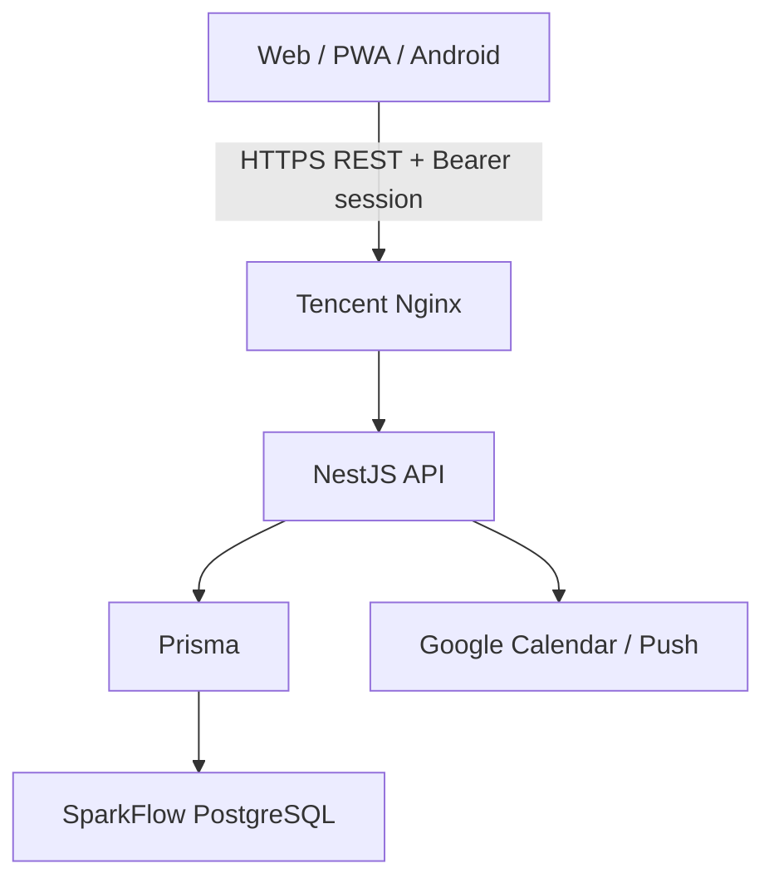
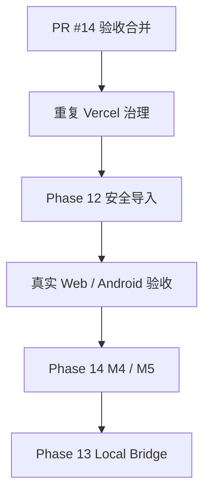

# SparkFlow — 项目开发蓝图

> **角色**：决策记录、当前架构、进度与问题总览。具体执行顺序见 [docs/plans/NEXT.md](docs/plans/NEXT.md)。
>
> **创建时间**：2026-05-06 | **最后更新**：2026-09-15 | **代码基线**：`master@4d9ebe1`
>
> **当前 Phase**：Phase 14 M3（PR #14 开放、待验收合并）→ Phase 12 服务端安全导入与真实验收

---

## 一、决策点总览

### 当前有效决策

| # | 决策 | 当前方案 | 理由 |
|---|---|---|---|
| 1 | 生产数据与认证 | 腾讯云独立自建 PostgreSQL + SparkFlow API 自建密码/会话认证 | 与 DeepTutor 数据库隔离；认证和数据归属由服务端统一控制 |
| 2 | 业务数据链路 | PWA/APK → NestJS REST → Prisma → PostgreSQL | 纯 REST CRUD，避免多事实源 |
| 3 | 生产入口 | Web：Vercel `sparkflow031` / `fish-life.cc.cd`；API：腾讯云 `api.fish-life.cc.cd` | 保持前端静态托管，同时让 API/数据库自主可控 |
| 4 | 客户端 | React 19 + TypeScript + Vite；Capacitor 复用同一前端构建 Android APK | Web、PWA 与 Android 共享能力 |
| 5 | 日程事实源 | Task 与 CalendarEvent 统一投影为 `ScheduleItem` | Today、Timeline、Planner 共用同一显示与冲突口径 |
| 6 | 外部日历 | Google Calendar 由后端同步；Android 本地日历落入 CalendarEvent | 浏览器不能直接读取系统日历，统一落库后再投影 |
| 7 | 智能排程 | LLM 只负责语言→意图；确定性 Scheduler 决定时间 | 保证锁定、冲突、截止时间与撤销行为可复现 |
| 8 | 课程导入 | 浏览器/Android 负责获取、解析与预览；服务端负责授权、指纹、幂等与事务 | 避免重复提交、半套课表和跨用户写入 |
| 9 | 发布门禁 | 短期分支 → PR → Web/API CI → 主 Preview → 验收 → 合并 → 生产冒烟 | 开放 PR、健康接口和真实业务验收采用不同状态口径 |
| 10 | Local Codex Bridge | 独立本机 loopback Gateway，native Codex 为唯一执行事实源 | 与云端 API/数据库隔离，不建立第二套 runtime/transcript |

### 已被替代但保留追溯的历史决策

| 历史方案 | 替代状态 | 当前去向 |
|---|---|---|
| CURRENT_CONTEXT.md、ContextBridge、`contextMdHash`、`@start/@duration` | ❌ 2026-06-01 起被纯 REST 架构替代 | 历史审计见 [去 md 后审计](docs/archive/2026-05-29-post-md-transition-audit.md)；不得恢复为新功能基础 |
| API Key、前端 localStorage 账户、Supabase Auth | ❌ 被服务端自建密码/会话认证替代 | Phase 11 作为历史方案归档；生产以 `AuthSession` 与 `SessionAuthGuard` 为准 |
| Supabase PostgreSQL 主存储 | ❌ 2026-09-13 被腾讯云独立 PostgreSQL 替代 | Prisma 模型与迁移继续沿用；Supabase 不再是生产依赖 |
| Render API 部署 | ❌ 被腾讯云 Docker + Nginx 替代 | 历史部署记录保留在归档/冻结方案；当前部署见 [docs/DEPLOY.md](docs/DEPLOY.md) |

---

## 二、整体架构



生产数据库位于腾讯云 SparkFlow 独立环境，与 DeepTutor 的数据库、账户和迁移生命周期隔离。PostgreSQL 与 API 容器端口仅绑定服务器内部/回环网络；公网只暴露 Nginx HTTPS API。

### 关键目录

```text
sparkflow/
├── api/
│   ├── src/auth/              # 自建注册、登录、改密、会话
│   ├── src/tasks/             # Task REST CRUD
│   ├── src/calendar/          # CalendarEvent 查询
│   ├── src/course/            # 课程、实例、备份与教务集成
│   ├── src/planner/           # 确定性排程 Preview/Apply/Undo
│   ├── src/pomodoro/          # 专注记录
│   ├── src/google-calendar/   # Google 双向同步
│   └── prisma/                # Schema 与 additive migrations
├── web/
│   ├── src/components/today/  # Today Rhythm
│   ├── src/components/schedule/ # 统一安排编辑器
│   ├── src/components/focus/  # Focus
│   ├── src/components/planner/# Planner UI
│   ├── src/components/        # Tasks、Course、Calendar 等现有视图
│   └── android/               # Capacitor Android
├── docs/plans/                # 活跃、后续及冻结方案
├── docs/archive/              # 已完成/历史方案
└── PROJECT_BLUEPRINT.md
```

### 数据与身份边界

1. `SessionAuthGuard` 从 bearer token 的哈希查询 `AuthSession`，以服务端 session userId 作为数据隔离事实源。
2. 客户端不得把 `userId` 参数当授权依据；业务服务必须按当前用户过滤。
3. `Task`、`CalendarEvent`、`Course`、`Semester`、`PomodoroSession` 与 `SchedulePlan` 均存入 SparkFlow PostgreSQL。
4. Local Codex Bridge 若实施，只运行于桌面 loopback，不进入上述生产链路。

---

## 三、实施进度

| 范围 | 状态 | 说明 |
|---|---|---|
| Phase 1–8 | ✅ 历史完成 | PWA、REST、课程基础、Google Calendar、Capacitor 等；其中 md/Render/Supabase 部分已被后续架构替代 |
| Phase 09 | ⚠️ 冻结重估 | CourseDetail、CourseNote、Today 课程投影等已覆盖大量目标；真实剩余项见方案 |
| Phase 10 | ⚠️ 冻结重估 | md 扩展取消，正式认证完成；推送、事件类型、灵感转化降为 P2 |
| Phase 11 | ✅ 已归档 | 早期账户与 onboarding；生产认证已由腾讯云自建认证替代 |
| Phase 12 | 🚧 当前主线 | M1/M2.1/M2.2/M2.3 已合并；服务端幂等/冲突策略与真实 Web/Android 导入待完成 |
| Phase 13 | ⬜ 后续队列 | 方案完成、未实施；待 Phase 12/14 稳定后启动 |
| Phase 14 M1/M2 | ✅ 代码已合并 | UI Foundation、Today/Schedule Layer 已进入 master；真实移动端回归仍保留 |
| Phase 14 M3 | 🚧 PR #14 开放 | Web/API CI 与主 Preview 成功，尚未合并；不可标记 V5 Core 完成 |
| Phase 14 M4 | 🚧 部分完成 | 确定性 Scheduler、Preview/Apply/Undo 已合并；自然语言意图、顺延与生产数据验收待完成 |
| Phase 14 M5 | 🚧 部分完成 | Focus 已合并；Daily Receipt、核心深色迁移、Android Widget 待完成 |

完整分类见 [实施方案索引](docs/plans/INDEX.md)。

---

## 四、技术选型

| 层级 | 技术 | 当前用途 |
|---|---|---|
| 前端 | React 19、TypeScript 6、Vite 8、Zustand 5、Tailwind CSS 4 | Web/PWA/Android 共用 UI 与状态 |
| 导航 | Zustand `activeTab` + 可扩展 navigation registry | 无 React Router；兼容旧导航配置迁移 |
| 日历 | FullCalendar 6 + `ScheduleItem` projection | Month/Week/Timeline 与多来源日程 |
| 移动端 | Capacitor 8、Android Gradle | APK、本地日历、通知与 deep link |
| 后端 | NestJS 11、TypeScript、Node.js 22 | 业务 API、认证、同步、Planner |
| ORM/数据库 | Prisma 7、PostgreSQL 17 | 腾讯云独立主存储与迁移 |
| 认证 | 服务端密码哈希、随机 session token、tokenHash 持久化 | 注册/登录/退出/改密与跨用户隔离 |
| 外部集成 | Google Calendar API、Web Push/FCM、WebDAV | 日历、提醒与课表备份 |
| 部署 | 腾讯云 Docker + Nginx（API/DB）；Vercel `sparkflow031`（Web） | 当前生产架构 |

---

## 五、使用与验证

```bash
# API
cd api
npm run build
npm test

# Web
cd web
npm run build
npm test

# Android（联网或已有 Gradle 缓存环境）
cd web
npm run android:build

# 生产健康
curl -fsS https://api.fish-life.cc.cd/api/health
```

健康 200 只证明 API 进程可用；发布验收还必须使用真实账户验证 Auth、tasks、semesters、courses、schedule，以及涉及 migration 的写入/撤销流程。

---

## 六、更新日志

### 2026-09-15

- ✅ **蓝图与计划重整**：以 `master@4d9ebe1`、腾讯云自建 PostgreSQL/认证和 `sparkflow031` 为当前事实源；Render/Supabase/md 方案明确为历史替代项。
- ✅ **统一近期队列**：新增 [NEXT.md](docs/plans/NEXT.md)，确定 PR #14 → Vercel 重复项目 → Phase 12 安全导入/真实验收 → Phase 14 M4/M5 → Phase 13 的顺序。
- ✅ **历史计划收口**：Phase 11 归档；Phase 09/10 按现有代码重估；Phase 12/14 更新开放 PR、迁移和真机验收状态。

### 2026-09-14

- ✅ **Focus 与确定性 Planner 合并**：PR #13 合并为 `4d9ebe1`，加入专注状态机、Planner Preview/Apply/Undo 与 `SchedulePlan` migration；生产迁移及真实账户闭环仍待核验。

### 2026-09-13

- ✅ **生产架构迁移**：认证和数据库运行时迁至腾讯云自建 PostgreSQL/自建会话认证，前端继续使用 Vercel 主项目 `sparkflow031`。
- ✅ **Phase 12 M2.3 合并**：课程页入口、主题和 portal/safe-area 收口；生产 360px、Android 真机与实际文件选择仍待验收。

### 2026-09-12

- ✅ **V5 M1/M2 合并**：Design Tokens、AppShell、导航注册表、Today、Schedule Layer 和 Editor 进入主线。

更早的详细变更以 Git 历史和 [docs/archive/](docs/archive/) 为准。

---

## 七、已知问题与风险

| 优先级 | 问题 | 当前判断 | 关闭条件 |
|---|---|---|---|
| P0 | PR #14 尚未合并 | 主 CI/Preview 成功不等于真机与边界验收完成 | 360px/Android/多来源/DST 验收后合并并检查生产 |
| P0 | 两个旧 Vercel 项目制造失败噪声 | `sparkflow`、`sparkflow-psi1` 不是主项目，但影响 GitHub 总状态可读性 | 归档/断开旧项目 Git 集成，仅保留有效检查 |
| P0 | 课程导入不具备完整服务端幂等 | 现有恢复/导入可能新增副本；断网重试有数据风险 | requestId、指纹、事务、结果查询和重复策略全部通过集成测试 |
| P0 | 真实导入尚未闭环 | 360px、Web 真学校、Android 文件/原生路径未完成 | Web/Android 各一条真实路径与生产业务冒烟通过 |
| P0 | `SchedulePlan` 生产迁移状态需核验 | 健康接口无法证明表已迁移或 Apply/Undo 可用 | 确认 migration 并用真实账户跑通 Preview → Apply → Undo |
| P1 | V5 Core 未完成 | M3 仍在开放 PR | PR #14 合并并完成生产回归 |
| P1 | 全仓 lint 存量债务 | 旧 CalendarView、modal、API/store 仍有既有错误 | 建独立清债批次后再将 lint 设为 required check |
| P2 | Web Push/VAPID 生产状态未核实 | 旧 Render 配置已失效 | 腾讯云环境配置与 Web/Android 实际送达验收 |

---

## 八、下一步方针



执行原则：

1. **先收口开放工作**：不在 PR #14 未验收时并行重写旧 CalendarView。
2. **先数据安全，后功能扩展**：Phase 12 优先服务端幂等、冲突与事务，再做额外课程功能。
3. **先真实链路，后宣布完成**：Preview/CI/health 各自只是门禁之一，不能替代真机和生产业务读写。
4. **减少并行主线**：Phase 09/10 冻结，Phase 13 排到 Phase 12/14 稳定后，避免导航、Settings、Schema 冲突。
5. **保持迁移可逆性**：数据库只做 additive migration；导入、Planner 必须可对账、回滚或安全撤销。

逐项任务和完成门槛见 [NEXT.md](docs/plans/NEXT.md)。

---

## 九、文档导航

| 文档 | 说明 |
|---|---|
| [docs/plans/NEXT.md](docs/plans/NEXT.md) | 唯一近期执行队列与完成门槛 |
| [docs/plans/INDEX.md](docs/plans/INDEX.md) | 当前主线、后续、冻结与归档分类 |
| [docs/plans/phase12-course-import-experience.md](docs/plans/phase12-course-import-experience.md) | 当前课程导入与数据安全方案 |
| [docs/plans/phase14-rhythm-experience.md](docs/plans/phase14-rhythm-experience.md) | V5 Today/Timeline/Planner/Focus/Review 方案 |
| [docs/plans/phase13-local-codex-bridge.md](docs/plans/phase13-local-codex-bridge.md) | 后续本机监督接入方案 |
| [docs/plans/phase09-course-module.md](docs/plans/phase09-course-module.md) | 冻结的 Course 历史目标与现状核对 |
| [docs/plans/phase10-pending-features.md](docs/plans/phase10-pending-features.md) | 冻结的历史待办与去向 |
| [docs/archive/phase11-auth-registration-onboarding.md](docs/archive/phase11-auth-registration-onboarding.md) | 已完成并被生产认证替代的早期账户方案 |
| [docs/DEPLOY.md](docs/DEPLOY.md) | 腾讯云自托管 API/数据库与 Vercel 部署手册 |
| [docs/archive/](docs/archive/) | 历史方案与设计决策 |

### 文档管理规则

1. `PROJECT_BLUEPRINT.md` 只维护决策、架构、进度、问题和方针；详细任务进入 Phase 文档。
2. 近期动作只在 `NEXT.md` 排序；完成后同步 Blueprint、INDEX 与对应 Phase。
3. 已完成方案移入 `docs/archive/`；冻结方案不得未经重估直接恢复开发。
4. 历史架构可以保留，但必须明确“已被替代”，避免与生产现状混淆。
