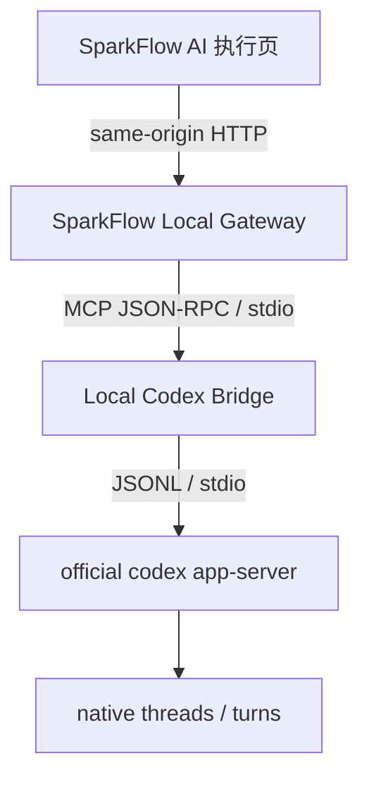
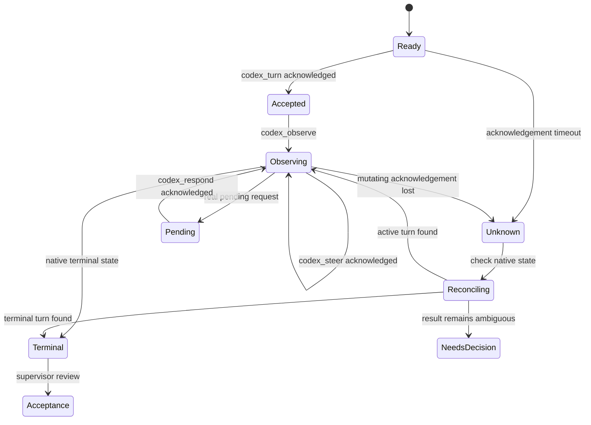

# Phase 13：Local Codex Bridge 本机监督接入

> 状态：方案完成，待实施。本方案只定义实施边界、模块、接口、状态机、测试与验收；本次不新增 Gateway 或前端功能代码。

## 1. 目标与核心原则

在 SparkFlow 增加一个仅在受支持桌面本机环境启用的“AI 执行”入口，让用户从现有任务发起 native Codex turn，并在 SparkFlow 中观察、纠偏、审批、中断和验收执行结果。

核心原则保持不变：

```text
Native Codex owns execution state.
Bridge owns supervision, not a second runtime.
```

SparkFlow 负责用户任务和监督体验；Local Codex Bridge 负责已有 MCP 监督工具；official Codex app-server 及 native Codex 仍然唯一拥有 thread、turn、history、command、file change、sandbox 和 approval 状态。

本项目中的 `Task` 不是 Codex job，SparkFlow 不复制 Codex transcript，也不建立第二套执行调度系统。

## 2. 已核实事实基线

### 2.1 SparkFlow 当前结构

本方案基于当前 `master` checkout，而不是参考仓库的静态站结构：

- `web/` 是 React 19 + TypeScript + Vite 8 前端，使用 Zustand，构建结果同时服务 PWA、Vercel 和 Capacitor Android。
- `api/` 是 NestJS 11 + Prisma 7 后端，通过 Render 连接 Supabase PostgreSQL；现有 `/api` 路径用于业务 REST API。
- `web/src/api/client.ts` 会处理 SparkFlow 云端 API 地址和 Supabase access token，不适合承载本机 Bridge 调用。
- `web/vite.config.ts` 当前仅把 `/api` 代理到本地 NestJS；本机 Codex 接口必须使用独立前缀，避免混入业务 API。
- `web/src/App.tsx`、`web/src/types/index.ts` 和 `web/src/store/uiSlice.ts` 共同维护主导航；导航顺序与可见性已持久化在 localStorage。
- `Task` 通过现有 REST/Supabase 持久化；Prisma 中的 `AIConversation` 也不能被复用为 Codex transcript 或 thread lifecycle 存储。
- 云端 Vercel 页面和 Capacitor Android 不能被假定可以安全、可靠地访问桌面 `localhost`。

因此，参考方案中的 `index.html`、`app.js`、GitHub Pages 和纯 localStorage 假设不适用于 SparkFlow；目录和接入方式按当前仓库调整。

### 2.2 Local Codex Bridge 当前事实源

核查对象为 `zoeynine/Local-Codex-Bridge` 当前 `main`：

| 项目 | 当前事实 |
|---|---|
| 核查提交 | `ff5d8804008a5a8c483a5925bd20c90f21cc67fd` |
| package 版本 | `2.1.3` |
| Node 要求 | Node.js 24 或更高 |
| 支持平台 | Windows、macOS；Linux 明确不支持 |
| 严格 MCP 启动 | `node <absolute-bridge-path>/dist/src/index.js` |
| 公共工具数 | 8 |
| Bridge stdout | 仅 MCP protocol；日志必须走 stderr |
| observe 等待上限 | `wait_ms <= 10000` |
| 生命周期 | Bridge 不自动重启 app-server；Gateway 也不得擅自增加该语义 |

已按 `AGENTS.md`、`README.md`、`PROTOCOL-ASSUMPTIONS.md`、`CHANGELOG.md`、`package.json`、`src/mcp.ts`、`src/app-server.ts`、`src/tools.ts`、`src/runtime.ts`、`src/checkpoint.ts` 和对应测试建立 source + tests truth。当前 source/tests 与 V2.1.3 文档未发现影响本方案的实质差异。

本地核验中 `npm ci`、`npm run typecheck`、`npm run build` 通过；Linux 下测试受仓库显式平台保护影响，不能替代 Windows/macOS 正式测试。实施时必须在受支持平台重新运行完整测试和单独授权的 live smoke test。

### 2.3 固定工具目录

Gateway 初始化后必须通过 `initialize`、`initialized`、`tools/list` 验证下列精确目录：

| HTTP projection | Bridge tool | 类型 |
|---|---|---|
| `threads` | `codex_threads` | 读取/恢复入口，具体动作按工具 schema |
| `models` | `codex_models` | 读取 |
| `turn` | `codex_turn` | 变更 |
| `observe` | `codex_observe` | 读取/长轮询 |
| `steer` | `codex_steer` | 变更 |
| `respond` | `codex_respond` | 变更 |
| `interrupt` | `codex_interrupt` | 变更 |
| `checkpoint` | `codex_checkpoint` | 变更/监督锚点 |

Gateway 不通过名称猜测兼容性，也不偷偷接受额外工具。目录缺失、增加或输入 schema 与支持基线不兼容时，状态进入 `degraded`，读取状态仍可用，但所有变更调用关闭，并向用户显示兼容性错误。

## 3. 目标架构与部署边界



### 3.1 两种本机页面接入方式

1. **本机构建模式（正式监督入口）**：Gateway 从 `web/dist` 提供 SparkFlow 静态资源，并在同一 loopback origin 提供 `/local-codex/api/*`。用户只需打开 Gateway 给出的 `127.0.0.1` 地址。
2. **本机开发模式**：Vite 保持提供 React HMR，并把 `/local-codex/api` 代理到 Gateway。现有 `/api` 仍只代理 NestJS。

端口均通过配置确定，文档和代码不写维护者个人端口。Gateway 只绑定 `127.0.0.1`，不得默认绑定 `0.0.0.0`。

### 3.2 云端与 Android 行为

- Vercel/PWA 云端部署继续运行全部普通 SparkFlow 功能，但默认不启用本机 Codex client，也不从 HTTPS 页面探测用户 localhost。
- Capacitor Android 构建不展示可操作的本机 Bridge 控件；若导航状态来自旧 localStorage，仍须回退到可用 tab。
- 功能只有在显式构建开关、本机 loopback origin、非 Capacitor 环境三项同时满足时启用。
- Render NestJS API、Supabase、Service Worker 和 Android 原生插件不加入 Bridge 控制链路。

建议启用条件：

```text
VITE_LOCAL_CODEX_ENABLED=true
AND location.hostname in {127.0.0.1, localhost}
AND Capacitor.isNativePlatform() == false
```

`localhost` 仅用于开发兼容；正式启动器应输出并打开 `127.0.0.1` 地址。任何条件不满足时返回明确的 `unavailable` UI，而不是循环请求。

## 4. 建议目录与模块职责

```text
sparkflow/
├── local-bridge-gateway/
│   ├── package.json
│   ├── src/
│   │   ├── server.mjs
│   │   ├── config.mjs
│   │   ├── bridge-manager.mjs
│   │   ├── mcp-client.mjs
│   │   ├── tool-contract.mjs
│   │   ├── routes.mjs
│   │   └── static-server.mjs
│   └── test/
│       ├── gateway.test.mjs
│       ├── mcp-client.test.mjs
│       ├── bridge-manager.test.mjs
│       └── tool-contract.test.mjs
├── web/src/features/local-codex/
│   ├── LocalCodexView.tsx
│   ├── client.ts
│   ├── types.ts
│   ├── availability.ts
│   ├── useSupervisor.ts
│   └── components/
│       ├── BridgeStatusCard.tsx
│       ├── TaskLaunchPanel.tsx
│       ├── SupervisorConsole.tsx
│       ├── PendingRequestCard.tsx
│       └── AcceptancePanel.tsx
├── docs/plans/phase13-local-codex-bridge.md
└── PROJECT_BLUEPRINT.md
```

选择独立顶层 `local-bridge-gateway/`，而不放进 `api/`，原因是两者信任域、部署位置、Node 版本和生命周期完全不同。Gateway 是桌面本机进程；`api/` 是公开部署的业务数据服务。二者不得共享控制路由或发布单元。

### 4.1 `server.mjs`

负责：

- 在经过校验的 loopback host 上监听；
- 注册严格的静态路由和 `/local-codex/api/*` 路由；
- 应用 Host/Origin、method、Content-Type 和 body size 检查；
- 启动并持有一个 Bridge manager；
- 处理 `SIGINT`/`SIGTERM`，停止接收请求并有界等待在途读取后关闭子进程；
- 把结构化应用日志写到 stderr，绝不写入 Bridge stdout。

它不提供 shell、文件浏览器、任意进程或原始 JSON-RPC 入口。

### 4.2 `config.mjs`

只读取和校验明确配置：

- Bridge 安装目录或入口文件；
- 可选 Gateway host/port，其中 host 只接受 loopback；
- `web/dist` 路径；
- 日志级别和 body limit；
- official Codex executable：优先从 `PATH` 解析，其次使用显式 `CODEX_EXE`。

不得提交绝对开发者路径、token、secret 或预构建 Codex runtime。Bridge 路径通过环境变量或启动参数注入，并在启动前解析为真实绝对路径、验证目标文件存在。

### 4.3 `bridge-manager.mjs`

负责：

- 精确执行 `node <absolute-bridge-path>/dist/src/index.js`；
- 使用 pipe 建立 stdin/stdout/stderr，记录 PID、启动时间和退出信息；
- 把 stdout 只交给 MCP framing，不解析为普通日志；
- 将 Bridge stderr 以脱敏、限长形式写到 Gateway stderr；
- Bridge 退出后把状态标为 `exited`，拒绝后续工具调用；
- 在用户明确操作下允许重启 Bridge 进程，但不得自动重启 Bridge 或 app-server，也不得重放任何变更调用。

严格 MCP 链路不得使用 `npm start`，避免 npm 生命周期输出污染协议。

### 4.4 `mcp-client.mjs`

负责：

- MCP `initialize` 请求及 `initialized` 通知；
- `tools/list` 与 `tools/call`；
- JSON-RPC request ID 生成、在途表和响应关联；
- 消息 framing、乱序响应、通知和合法错误对象；
- 读取超时与变更 acknowledgement timeout 的不同语义；
- 进程退出时拒绝未完成请求，并携带请求是否已经写入子进程的信息。

变更请求一旦完整写入 Bridge stdin，若未在确认窗口收到结果，必须返回 `unknown_possibly_accepted`。此类请求从在途表移除后也不能自动重发。

### 4.5 `tool-contract.mjs`

维护支持版本所需的精确工具名、必要 schema 特征及读取/变更分类。它是跨进程边界的启动兼容检查，不是版本哈希或第二份模型目录。

检查失败时保留实际 `tools/list` 的安全摘要供诊断，只显示工具名和 schema 差异，不把未知工具开放成通用代理。

### 4.6 `routes.mjs`

负责把固定 HTTP route 一一投影为固定 Bridge tool；每条路由有独立的输入 schema、超时分类和错误映射。禁止接受客户端传入 `toolName` 后直接调用。

### 4.7 `static-server.mjs`

只从配置后的 `web/dist` 根目录提供构建产物，完成路径规范化、防目录穿越、SPA fallback、正确 MIME 和无目录列表。API 路径永不落入 SPA fallback。

## 5. Gateway HTTP 契约

统一前缀使用 `/local-codex/api`，避免与现有 NestJS `/api`、Vite proxy 及云端鉴权客户端混淆。

| Method | Route | 固定行为 |
|---|---|---|
| GET | `/local-codex/api/status` | 返回 Gateway、Bridge、MCP、app-server 可观测状态与兼容性 |
| GET | `/local-codex/api/tools` | 返回已验证的安全工具摘要；不返回可调用任意名称的接口 |
| POST | `/local-codex/api/threads` | 调用 `codex_threads` |
| POST | `/local-codex/api/models` | 调用 `codex_models`，仅用户打开选择器时使用 |
| POST | `/local-codex/api/turn` | 调用 `codex_turn` |
| POST | `/local-codex/api/observe` | 调用 `codex_observe` |
| POST | `/local-codex/api/steer` | 调用 `codex_steer` |
| POST | `/local-codex/api/respond` | 调用 `codex_respond` |
| POST | `/local-codex/api/interrupt` | 调用 `codex_interrupt` |
| POST | `/local-codex/api/checkpoint` | 调用 `codex_checkpoint` |

不增加以下接口：

```text
/api/shell
/api/exec
/api/raw-rpc
/api/process
/local-codex/api/call/:tool
```

### 5.1 响应封装

成功响应只包裹传输元数据，不改写 Bridge payload：

```json
{
  "ok": true,
  "requestId": "gateway-generated-id",
  "data": {}
}
```

错误响应：

```json
{
  "ok": false,
  "requestId": "gateway-generated-id",
  "error": {
    "code": "unknown_possibly_accepted",
    "message": "请求可能已被 native Codex 接受，不能安全重试。",
    "retryable": false,
    "reconcile": true,
    "details": {}
  }
}
```

`details` 只含白名单诊断字段；不得回传环境变量、完整命令行、任意路径内容或未脱敏 stderr。

### 5.2 错误码

| code | 含义 | UI 行为 |
|---|---|---|
| `bridge_not_ready` | Bridge 尚未启动或已退出 | 显示状态和人工启动/重启指引 |
| `mcp_not_initialized` | MCP handshake 未完成 | 禁止调用，刷新状态 |
| `tool_contract_mismatch` | 8-tool 契约不兼容 | degraded，只读诊断，禁止变更 |
| `native_rejected` | native 明确拒绝请求 | 显示原始安全错误，不标记 UNKNOWN |
| `unknown_possibly_accepted` | 变更已写入但确认超时/连接丢失 | 禁止重试，只提供原生对账 |
| `pending_request_conflict` | 响应目标已处理、改变或不再 pending | 刷新 observe，不猜测结果 |
| `unsupported_request_method` | Bridge 当前不能响应该方法 | 保持 pending，说明限制 |
| `invalid_scope` | workspace/thread/turn 组合不合法 | 就地修正输入 |
| `bridge_process_exited` | 子进程退出 | 保留 UI 上下文，要求重新查询 native 状态 |
| `protocol_error` | framing/JSON-RPC 响应非法 | 停止变更，展示诊断 |

只有明确未写入子进程的幂等读取请求才可由用户重试。Gateway 不内置自动重试 runtime。

## 6. 前端集成设计

### 6.1 独立 client

`web/src/features/local-codex/client.ts` 使用相对地址 `/local-codex/api`，不导入常规 `web/src/api/client.ts`，不附加 Supabase access token，也不读取 `VITE_API_BASE_URL`。

所有 endpoint 都有显式 TypeScript 输入/输出类型；`AbortController` 只终止浏览器等待，不能把已发送的变更操作解释为已取消。observe 可在 tab 离开或组件卸载时取消前端等待。

### 6.2 导航与兼容迁移

- 在 `ActiveTab` 和 `ToggleableNavTab` 增加 `local-codex`，导航显示名为“AI 执行”。
- 默认只在 `availability.ts` 判定本机功能可用时加入实际导航列表；设置页可以隐藏该入口。
- `readStoredNavVisibility` 对旧值补齐新 key；`readStoredNavOrder` 把缺失项按默认位置补入，过滤未知值，保持现有迁移方式。
- 若当前 tab 在 Capacitor、云端或功能关闭后变为不可用，回退到现有可见 tab，不能渲染一个持续报错的控制页。
- `App.tsx` 只负责注册导航与视图，不把监督状态继续堆入根组件。

### 6.3 页面区块

#### A. Bridge 状态

展示：

- Local Gateway：状态、版本、PID/启动时长的安全摘要；
- Local Codex Bridge：版本、进程状态、tool contract；
- Codex app-server：Bridge 实际报告的可用状态；
- 当前 workspace、thread、turn 和 native status；
- 最近一次状态刷新时间与错误。

运行状态来自 Gateway/Bridge 实时查询，不从 localStorage 猜测。UI 文案必须区分 `unavailable`、`starting`、`ready`、`degraded`、`exited`。

#### B. 任务启动

支持：

- 从 Zustand 当前 `tasks` 选择一个 SparkFlow task，或填写不落库的临时任务；
- 选择并校验 workspace；
- 选择 new thread，或输入/选择经 native 查询确认存在的 existing thread；
- 设置 sandbox、approval policy；
- 可选 model 和 reasoning effort。

默认 `model`、`effort` 均省略。只有用户主动展开模型选择器时调用 `codex_models`；不缓存 model catalog，不从 `thread/read` 推断 current model，也不建立 current-model registry。

已有 `lastThreadId` 只能是恢复提示。重新执行前必须读取 native thread，核对 workspace、目标和上下文是否仍匹配，再由用户决定 resume 或 new thread，禁止盲目 resume。

#### C. Supervisor Console

展示：

- native thread/turn 标识和状态；
- Bridge 返回的 bounded live events 与 terminal output；
- pending requests；
- Steer、Interrupt 和“检查原生状态”；
- terminal 后的人工验收面板。

界面只保存本次打开页面所需的有限内存状态；刷新后通过 Bridge/native 重建当前视图，不把事件流扩展成第二份 transcript。

### 6.4 Task 与 thread 的轻量引用

Phase 13 v1 不修改 Prisma `Task` schema，也不把引用同步到 Supabase。若恢复体验需要，可以在桌面本机 localStorage 单独存储：

```ts
type CodexTaskRef = {
  taskId: string;
  workspace: string;
  lastThreadId: string;
  lastUsedAt: string;
};
```

它只能作为查询提示，不能包含：

```text
status
turns
transcript
pendingRequests
currentModel
```

native 查询失败时不得用旧引用宣布 thread 正在运行或已经完成。删除 SparkFlow task 可删除对应提示，但绝不删除 native thread。

## 7. 执行与监督状态机



### 7.1 `accepted != completed`

`codex_turn` 成功只允许显示“Codex 已接受本次 turn，正在执行”。任务完成必须来自后续 `codex_observe` 的 native terminal state，并经过 SparkFlow 用户验收；不能因 HTTP 200、Bridge accepted 或一段输出而标记完成。

SparkFlow task 的业务状态也不随 Codex terminal 自动变为 done。Acceptance panel 由用户选择是否回到现有任务编辑动作更新任务。

### 7.2 Observe 循环

监督循环由当前打开的 `LocalCodexView` 驱动：

1. `codex_turn` 被确认接受；
2. 调用 `codex_observe`，`wait_ms` 不超过当前 Bridge 上限 10000ms；
3. 使用响应 cursor 发起下一次 observe；
4. 遇到 pending、用户动作、错误或 terminal 时按状态分支；
5. tab 离开、页面隐藏较久或组件卸载时停止浏览器循环；返回页面后重新读取 native 状态。

silence 不是 stall。不能根据“长时间没有新 command”自动 steer，也不能在 Gateway 建永久 polling job、后台 Codex queue 或 timer-based steer。

### 7.3 Steer 与 Interrupt

- Steer 必须带当前 native 返回的精确 `thread_id` 和 active `turn_id`；发送前在 UI 展示目标。
- Interrupt 只中断明确选择的 active turn；按钮需要二次确认，但不得把确认对话框误当 native 状态。
- 两者确认超时都进入 UNKNOWN，不得自动重试。

## 8. UNKNOWN / possibly accepted 对账

以下 native 变更在完整写入后出现 acknowledgement timeout 时进入一级状态 `UNKNOWN`：

```text
thread/start
thread/resume
turn/start
turn/steer
turn/interrupt
```

UI 固定说明：

> 请求已经发送，但未在确认窗口内收到结果。操作可能已经被 native Codex 接受，因此当前不能安全重试。

UNKNOWN 页面不显示“重试”主操作，只显示“检查原生状态”。对账流程：

1. 保留操作类型、workspace、原 thread/turn、Gateway request ID 和发送时间；不伪造 native ID。
2. 通过 `codex_observe` 查询已知 thread/turn；必要时用 `codex_threads` 的 read/list 能力核对新状态。
3. 找到匹配 active turn：恢复 observing。
4. 找到 terminal：进入 terminal 和 acceptance。
5. 明确 native 拒绝或没有接受且 Bridge 能证明未创建：允许用户重新提交一个新操作。
6. 仍不确定：保持 `NeedsDecision`，展示 native Codex 客户端人工核对指引，不能降级为普通 failure。

对账匹配使用 native 返回的标识和时间/工作区线索，不用 cwd/search filter 充当访问控制，也不靠输出文本模糊匹配后自动认领 thread。

## 9. Pending Request 处理

Pending 卡片完整保留并原样回传：

```ts
type PendingRequestIdentity = {
  request_id: string | number;
  method: string;
  thread_id: string;
  turn_id: string;
};
```

JSON 解码、Zustand/React state 和再次编码的全链路不得重新编号、统一转字符串、自行生成 request ID 或猜 response schema。

当前 Bridge 支持的响应方法以 `src/tools.ts` 为准，包括：

- `item/commandExecution/requestApproval`；
- `item/fileChange/requestApproval`；
- `item/permissions/requestApproval`；
- legacy `execCommandApproval`；
- legacy `applyPatchApproval`；
- `item/tool/requestUserInput`。

UI 根据方法渲染专用表单：命令、文件变更、权限请求显示允许/拒绝所需字段；用户输入按 Bridge schema 呈现问题和答案。点击后锁定该卡片直到明确结果或 UNKNOWN，防止双重回应。

当前不支持的 `mcpServer/elicitation/request` 只显示“当前 Bridge 不支持响应，此请求仍保持 pending”，不得自动回答、移除或伪造成拒绝。

## 10. Checkpoint 与最终验收

Checkpoint 是可选的 supervisor cognition anchor，只在复杂、长期、容易目标漂移的执行中由用户主动创建。建议呈现：

- original goal / constraints / acceptance；
- effective goal 与 current amendment；
- current understanding / decision；
- acceptance status / next step。

禁止按时间、observe 次数或 token 数自动创建；不得把 checkpoint 当 transcript、任务状态或恢复执行所必需的数据库。

terminal 后的 Acceptance panel 展示 native 结果摘要、待验证项和 SparkFlow 原任务。用户可以：

- 验收并用现有 task 更新动作标记完成；
- 要求继续，以明确 prompt 发起新 turn 或在核验后 continuation；
- 标记未通过并保留原任务状态。

这些选择不改写 native 历史，也不由 Gateway 自动决定。

## 11. 安全与信任边界

### 11.1 网络入口

- listener 固定 loopback，host 配置拒绝非 loopback 地址；
- 校验 `Host` 只对应实际 listener，并对浏览器请求做精确 Origin allowlist；
- 正式同源模式只接受 Gateway 自己的 origin；Vite 开发 origin 必须显式配置；
- 拒绝无 Origin 的浏览器变更请求；如需非浏览器健康检查，仅对 GET 状态开放明确规则；
- 只接受 JSON，统一 body limit，超限在解析前拒绝；
- CORS 不使用 `*`，不支持凭据跨域泛化。

loopback 降低网络暴露，但不等于鉴权或 OS sandbox。真正文件/命令权限由 native Codex runtime、sandbox、approval policy 和当前 OS 用户共同决定。

### 11.2 请求范围

- 每个 route 使用 allowlist schema，拒绝未知顶层字段；
- workspace 必须是经解析的绝对目录并存在，但此校验只是输入正确性，不是 ACL；
- cwd 或 thread search filter 不能宣称阻止 native Codex 访问其他资源；
- 不提供 shell、exec、raw RPC、process control、任意 MCP tool 名或任意 app-server method；
- 不扩大 Bridge 的八工具表面。

### 11.3 日志与进程身份

- Gateway 启动日志记录版本、PID、平台、Bridge 版本和兼容状态；
- prompt、用户回答、命令输出、文件内容、环境变量和 token 默认不进入日志；
- 错误只记录 code、route、request ID、持续时间和脱敏进程状态；
- Bridge stdout 永不镜像到普通日志；stderr 限长并去除可识别 secret；
- status 返回当前进程身份摘要，帮助用户确认连接的是本机预期 Gateway，但不暴露完整命令行。

## 12. 明确非目标

Phase 13 不设计或实现：

- 第二套 task/job system、thread lifecycle database 或 Codex transcript database；
- current-model registry、长期 model catalog cache；
- generic shell/exec/raw JSON-RPC/process API；
- background Codex queue、自动重试 runtime、timer-based steer；
- Bridge 自动重启、Codex app-server 自动重启或变更调用重放；
- 伪造 pending request ID、把数字 ID 转成字符串；
- 把 cwd、workspace picker 或 thread search filter 当 ACL；
- Vercel → localhost 或 Android → 桌面 Gateway 作为 v1 路径；
- tunnel、远程访问、多用户 Gateway、云端部署 Gateway；
- 修改 Local Codex Bridge 仓库或安装另一份 npm Codex runtime；
- 用 Prisma/Supabase 保存 native 执行状态；
- 在本轮开始任何功能实现。

## 13. 分阶段实施

### Phase 13.1 — Gateway Skeleton

交付：

- 建立 Node 24+ 独立 package、配置解析和 loopback HTTP server；
- 启动已构建 Bridge，完成 initialize/initialized；
- 调用 tools/list 并验证精确 8-tool contract；
- 完成 status/tools endpoint、进程退出状态和 graceful shutdown；
- 建立静态 `web/dist` 服务和 Vite 开发代理配置。

完成条件：读取路径可用，契约不匹配会 degraded，任何变更 route 尚未开放。

### Phase 13.2 — Read-only Supervisor UI

交付：

- 新增独立 client、availability、类型和“AI 执行”导航；
- 展示 Gateway/Bridge/app-server 状态、workspace 和 thread 查询；
- 接入 `codex_threads`；模型选择器只在用户展开时调用 `codex_models`；
- 完成旧导航 localStorage 的前向迁移及云端/Android unavailable 行为。

完成条件：没有 mutating Bridge call；刷新页面不会从本地缓存猜 live 状态。

### Phase 13.3 — Minimal Execution Loop

交付：

- SparkFlow task 或临时任务转成显式 turn 输入；
- new/resume 决策前验证 native thread；
- `codex_turn -> accepted -> codex_observe -> terminal`；
- cursor progression、组件生命周期取消和 terminal 停止 observe；
- accepted 与 completed 使用不同状态和文案。

完成条件：一条真实测试任务可在受支持平台走到 terminal，且 SparkFlow task 不会被自动标为完成。

### Phase 13.4 — Supervisor Control

交付：

- 针对精确 active turn 的 `codex_steer` 和 `codex_interrupt`；
- pending request 专用 UI 与 `codex_respond`；
- raw request ID 类型与值端到端保真；
- 对不支持 elicitation 保持 pending 并说明限制。

完成条件：批准、拒绝、用户输入、steer、中断均有明确 native 回执路径，重复提交被前端锁定。

### Phase 13.5 — Failure / Reconcile

交付：

- `UNKNOWN / possibly accepted` 一级状态和无盲重试 UI；
- native observe + threads 对账；
- Bridge 进程丢失、协议错误、浏览器刷新恢复；
- bounded UI history、degraded 状态、unsupported request 体验；
- 人工 Bridge 重启后只重新查询，绝不重放操作。

完成条件：故障注入能证明任何已写入但未确认的 mutating call 都不会被自动重发。

### Phase 13.6 — Checkpoint / Acceptance

交付：

- 用户主动创建的可选 checkpoint；
- terminal 后 Acceptance panel；
- 验收后显式调用现有 SparkFlow task 更新逻辑；
- 本机构建启动文档和受支持平台 smoke test 手册。

完成条件：完整链路由用户验收结束，checkpoint 和 SparkFlow task 均未成为 native 状态替代品。

## 14. 确定性测试计划

### 14.1 Gateway 单元/集成测试

使用可控 fake Bridge child process 和 fixture messages，覆盖：

- initialize 参数、initialized 通知和 handshake 顺序；
- tools/list 精确 8-tool catalog、缺失/新增/错误 schema 时 degraded；
- 并发、乱序 JSON-RPC response 的 request ID correlation；
- 部分 frame、多个 frame、非法 JSON、未知 response ID 和 Bridge notification；
- Bridge stdout 混入非协议文本时 protocol_error；
- Bridge 在 handshake、读取请求、已写入变更请求后分别退出；
- 读取超时与 `unknown_possibly_accepted` 的差异；
- Origin/Host/Content-Type/body limit/method/未知路由拒绝；
- 静态路径穿越、API 不落 SPA fallback；
- 所有 route 固定映射，证明不存在 generic proxy；
- shutdown 不接受新请求、不自动重启或重放。

### 14.2 Web 测试

补充组件、hook 和 client 测试：

- cloud、loopback、Capacitor 和 feature flag 的 availability matrix；
- 旧 nav visibility/order 自动补齐 `local-codex`，未知值被过滤；
- accepted 不渲染 completed，只有 terminal 才进入验收；
- observe cursor 精确推进，terminal/卸载后停止；
- silence 不触发自动 steer；
- pending request 的数字/字符串 ID、method、thread、turn 原样发送；
- steer/interrupt 永远针对界面确认的 active turn；
- UNKNOWN 没有直接 retry，reconcile 后按结果转移；
- refresh 先查询 Gateway/native，不用 localStorage 伪造 live 状态；
- model picker 未展开时不调用 models；
- unsupported elicitation 保持 pending；
- task acceptance 只有用户确认后才调用现有任务更新。

### 14.3 Local Codex Bridge 供应方验证

每次首次安装或升级 Bridge，在 Windows/macOS 固定执行：

```bash
npm ci
npm run typecheck
npm run build
npm test
```

再启动 Gateway 验证 `initialize -> tools/list`。Live smoke test 单独、显式执行，因为它可能创建持久 native thread；自动测试不得默认创建真实 thread。

### 14.4 仓库级回归

实现各阶段后至少执行：

```bash
cd web
npm run lint
npm run build

cd ../api
npm run build
npm test
```

Gateway package 另行执行自身 lint/typecheck/test。Android 构建确认本机入口不可操作；Vercel 构建确认没有对 localhost 的后台请求。

## 15. 端到端验收清单

- Windows 和 macOS 各至少一条受支持安装路径完成 Bridge build、测试、Gateway handshake 和 status。
- Gateway 只监听 loopback；错误 Origin、Host、超大 body、未知 route 和任意 tool 名均被拒绝。
- 本机构建从同一 origin 加载 SparkFlow 和 Bridge API；Vite 开发代理不影响现有 NestJS `/api`。
- 云端 Vercel 与 Android 保留普通 SparkFlow 能力，不探测或调用桌面 localhost。
- tool catalog 与支持基线不匹配时禁止 mutating call，并给出可诊断差异。
- 从 SparkFlow task 启动 turn 后只显示 accepted/执行中；native terminal 后才出现验收。
- observe 使用 Bridge cursor 和等待上限，页面关闭后不留下 Gateway 后台轮询。
- pending approval/user input 的 request ID 类型和值端到端不变；不支持方法不会被自动回答。
- steer 和 interrupt 只作用于用户确认的 active thread/turn。
- 对已写入但确认丢失的变更故障注入后，界面进入 UNKNOWN，且网络、Gateway 和浏览器均不自动重试。
- Bridge 进程退出或浏览器刷新后，通过 native 查询恢复；本地提示数据不被当作真实状态。
- 没有新增 shell、exec、raw proxy、后台队列、自动重启、transcript DB 或 thread lifecycle DB。
- 最终 task 状态由用户验收后显式更新，不由 Bridge/Gateway 自动修改。

## 16. 实施顺序、提交边界与回滚

- 每个 13.x 子阶段独立提交，先 Gateway 只读基础，再前端读取，再逐步开放变更能力；不要在一个提交同时引入全部控制面。
- Phase 13.3 首次开放 `codex_turn` 前，必须已有工具契约检查、Origin/body limit 和 UNKNOWN 基础错误类型。
- Phase 13.4 每开放一种变更 route，同时加入该 route 的身份保真、故障注入和无重放测试。
- 回滚前端入口只需关闭构建开关；Gateway 仍可保留 status 诊断，但不能让隐藏 UI 后存在后台执行。
- 回滚 Gateway 版本不得杀死或删除 native thread；用户回到官方 Codex 客户端检查真实状态。
- Bridge 升级作为独立变更，先在受支持平台验证上游，再更新兼容契约；不通过模糊版本兼容或自动降级绕过。

## 17. 本轮交付边界

本次仅提交本方案、方案索引和项目蓝图中的 Phase 13 决策/导航记录。没有新增 `local-bridge-gateway/`、React 组件、API 路由、数据库变更或部署配置，也没有开始 Phase 13.1 编码。
